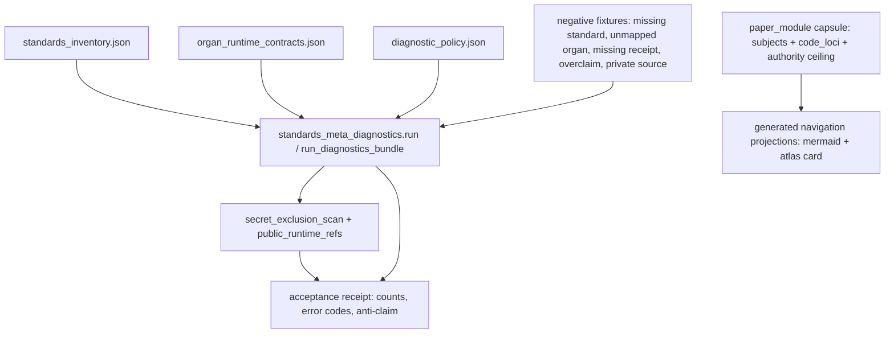

# Standards Meta Diagnostics

`standards_meta_diagnostics` is the terminal public coverage diagnostic for the
Microcosm runtime spine. It checks that accepted adapter-backed organs remain
mapped to standards, runtime contracts, receipts, and explicit authority
ceilings before a cold reader trusts the spine as coherent.

It consumes public `standards_inventory.json`, `organ_runtime_contracts.json`,
and `diagnostic_policy.json` inputs backed by registry refs, runtime commands,
acceptance receipts, and the exported diagnostics bundle. Its receipt contract
is source-open by default: `secret_exclusion_scan` proves that secrets,
account/session material, provider payload bodies, raw operator bodies, and
credential-equivalent live-access material are excluded, while
`public_runtime_refs` point at the real standards, organ, acceptance, fixture,
bundle, and paper-module substrate. Bodies are not inlined into JSON receipts,
so the positive evidence uses `body_in_receipt: false`,
`real_runtime_receipt: true`, and
`synthetic_receipt_standin_allowed: false`.

The organ rejects five boundary failures:

- accepted organ rows without `standard_id` or `standard_ref`
- accepted organs missing from the standards inventory
- accepted organ rows without receipt refs
- release, provider, publication, secret export, trading/advice, or
  whole-system correctness overclaims
- private source bodies or provider payload bodies in public diagnostics

## Purpose

A spine of accepted organs is only coherent if each organ is still attached to
the things that make it accountable: a standard that describes it, a runtime
contract that runs it, a receipt that records its last verdict, and an explicit
statement of what it is not allowed to claim. As the spine grows, those four
attachments drift out of step one organ at a time, and the drift is silent. A
new organ can be accepted into the runtime while its standard file, registry
row, or receipt ref is never added. Nothing breaks; the gap just sits there
until a reader trusts the spine and finds a hole.

This organ answers a single question: does every accepted organ still resolve to
a standard, a runtime contract, a receipt, and an authority ceiling, with no
extra and no missing entries? It treats the answer as a graph-closure check
rather than a written audit. The accepted-organ list, the standard rows, the
runtime-contract rows, and the receipt refs must agree on exactly the same set
of organs. Any organ that appears in one surface but not another becomes a
structured finding with a named error code, not a paragraph of prose.

The unusual choice is that the diagnostic refuses to grow its own authority. It
projects its positive coverage from the live registry rather than a checked-in
list, so a stale example cannot quietly become the thing the spine is measured
against. It carries five negative fixtures that must each surface their expected
failure, so the checker is itself falsifiable. And its receipts deliberately
hold refs, counts, hashes, and verdicts rather than the bodies they describe,
so a coverage report can be read in the open without exporting private source.

## Source-Open Body Floor

The public diagnostics bundle is source-open as evidence about refs, policies,
runtime contracts, and receipts. It may expose standards inventory rows, organ
runtime contract rows, diagnostic policy rows, acceptance receipt refs, fixture
refs, bundle refs, secret-exclusion scan verdicts, and public runtime refs.

It must not inline private source bodies, provider payload bodies, raw operator
voice, account/session material, credential-equivalent live-access material,
release-send state, or private macro-root bodies. The positive receipt evidence
therefore stays at `body_in_receipt: false`, `real_runtime_receipt: true`, and
`synthetic_receipt_standin_allowed: false`.

## Technical Mechanism

`standards_meta_diagnostics` is a public consistency validator over three
finite surfaces: a standards inventory, organ runtime contracts, and diagnostic
policy. The positive path either reads those exported JSON inputs or projects
them from the live public registry, then requires the accepted-organ list, the
standard rows, the runtime-contract rows, and the receipt refs to agree on the
same organ set. This is a graph-closure check, not a narrative audit: an
accepted organ without a standard ref, registry-backed standard row, runtime
step, validator command, or receipt ref becomes a structured finding.

The mechanism has four guarded stages:

1. `run` loads `standards_inventory.json`, `organ_runtime_contracts.json`, and
   `diagnostic_policy.json`, or projects the positive rows from live public
   registry state when the caller asks for live positives.
2. The validator checks every accepted organ row against a resolving
   `std_microcosm_<organ_id>` standard, the standards registry entry, the
   runtime shell step, a non-empty validator command, and non-empty receipt
   refs with `body_in_receipt: false`.
3. Five negative fixtures exercise the expected boundary failures:
   `missing_standard_ref`, `unmapped_accepted_organ`, `missing_receipt_ref`,
   `release_overclaim`, and `private_source_leakage`.
4. The exported-bundle path revalidates the same shape through
   `source_module_manifest.json`, exact source-module digest checks,
   source-open body-import accounting, `secret_exclusion_scan`, and the
   projection-only `AUTHORITY_CEILING`.

The output card deliberately omits the covered-organ list, findings,
secret-exclusion detail, source refs, public runtime refs, anti-claim, authority
ceiling, and source-module summary from the compact payload. Those keys remain
in the full receipt, which keeps the reader-facing card inspectable without
turning it into a private-body export.

## Shape



Evidence/accounting:

- `core/paper_module_capsules.json::paper_modules[29:paper_module.standards_meta_diagnostics]`
  is the JSON authority row. It names the organ and mechanism subjects, the
  resolved code locus
  `src/microcosm_core/organs/standards_meta_diagnostics.py`, and the
  projection-only authority ceiling.
- `paper_modules/standards_meta_diagnostics.json::paper_module_payload.source_authority`
  is `json_capsule`; `generated_projections.mermaid.status` is
  `available_from_capsule_edges`; `generated_projections.atlas_card.status` is
  `linked_from_capsule_edges`; `relationships.edges` currently has 11 edges.
- `organs/standards_meta_diagnostics.json::organ_payload.source_registry_row`
  records `status: accepted_current_authority`, the validator command, and the
  generated receipt refs; its `claim_ceiling` keeps the diagnostic scoped to the
  declared public contract.
- `src/microcosm_core/organs/standards_meta_diagnostics.py` names
  `INPUT_NAMES`, `NEGATIVE_INPUT_NAMES`, `EXPECTED_NEGATIVE_CASES`,
  `PUBLIC_RUNTIME_REFS`, and `AUTHORITY_CEILING`, which are the runtime
  contract this reader section summarizes.
- `tests/test_standards_meta_diagnostics.py` asserts the fixture and exported
  bundle paths, the five expected negative cases, source-module digest checks,
  `body_in_receipt: false`, `real_runtime_receipt: true`, and
  `synthetic_receipt_standin_allowed: false`.
- `receipts/acceptance/first_wave/standards_meta_diagnostics_fixture_acceptance.json`
  records `status: pass`, `accepted_organ_count: 77`,
  `standard_mapping_count: 77`, `runtime_contract_count: 77`, five expected
  error codes, `secret_exclusion_scan.blocking_hit_count: 0`, and the
  anti-claim that the diagnostic does not authorize release, providers,
  registry mutation, theorem correctness, or whole-system correctness.

## JSON Capsule Binding

- Source row:
  `core/paper_module_capsules.json::paper_modules[29:paper_module.standards_meta_diagnostics]`.
- `source_authority: json_capsule`.
- This Markdown is a reader projection. The generated Mermaid projection is
  `available_from_capsule_edges`; the generated Atlas projection is
  `linked_from_capsule_edges`. Both are navigation projections derived from the
  capsule row rather than source authority.
- The proof boundary is the public standards inventory, organ runtime
  contracts, diagnostic policy, accepted-organ refs, acceptance receipts,
  fixture refs, bundle refs, secret-exclusion scans, public runtime refs, and
  validation receipts.
- The authority ceiling excludes standards-registry mutation, source authority,
  private macro export, provider authority, release authority, publication
  authority, and whole-system correctness.

## Structured Lattice Bindings

- Identity and subject binding:
  `paper_module.standards_meta_diagnostics` explains the
  `standards_meta_diagnostics` organ and the
  `mechanism.standards_meta_diagnostics.validates_public_standards_meta_diagnostics`
  mechanism.
- Runtime locus:
  `src/microcosm_core/organs/standards_meta_diagnostics.py` is the resolved code
  locus for standards inventory checks, runtime contract checks, diagnostic
  policy checks, receipt refs, secret-exclusion scans, negative cases, and
  authority ceilings.
- Generated-row evidence:
  `paper_modules/standards_meta_diagnostics.json` currently contributes 11
  relationship edges: two `explains` edges, one `code_locus` edge, two concept
  edges, three principle edges, and three axiom edges.
- Residual boundary:
  one selective `depends_on` paper-module relation remains honest residual
  pressure because the capsule row does not yet name a real sibling module
  target.
- Projection boundary:
  Mermaid is `available_from_capsule_edges`, Atlas is
  `linked_from_capsule_edges`, and `source_authority` remains `json_capsule`.
  These are capsule-derived navigation projections, not standards-registry
  authority.

## Reader Evidence Routing

- Start with the JSON Capsule Binding to identify the capsule row and the
  projection-only authority ceiling before treating the diagnostic as evidence.
- Use Structured Lattice Bindings to understand which wiring is resolved and
  which dependencies remain pending. Pending dependencies are honest residuals,
  not hidden failures.
- Use Validation Receipt Path for reproducibility: focused pytest exercises the
  diagnostic policy and negative cases; the corpus check verifies paper-module
  parity.
- Treat secret-exclusion and public-runtime refs as receipt evidence about
  public projection consistency. They do not mutate standards, authorize
  release, expose private macro material, or prove whole-system correctness.

## Named Proof Consumers

- `tests/test_standards_meta_diagnostics.py::test_standards_meta_diagnostics_observes_negative_cases`
  is the fixture consumer. It proves that the positive public inputs cover the
  accepted organ set and that the five expected negative cases surface their
  named error codes.
- `tests/test_standards_meta_diagnostics.py::test_standards_meta_diagnostics_bundle_validates_runtime_shape`
  is the exported-bundle consumer. It checks the bundle id, covered organ set,
  source-module manifest status, source-open body-import counts,
  `body_in_receipt: false`, and the false authority-ceiling flags.
- `tests/test_standards_meta_diagnostics.py::test_standards_meta_diagnostics_rejects_source_module_digest_mismatch`,
  `::test_standards_meta_diagnostics_rejects_partial_source_module_digest_mismatch`,
  and `::test_standards_meta_diagnostics_rejects_partial_target_module_digest_mismatch`
  are the digest-drift consumers. They make copied source-module bodies
  falsifiable instead of relying on manifest prose.
- `tests/test_standards_meta_diagnostics.py::test_standards_meta_diagnostics_source_modules_are_exact_macro_body_imports`
  is the exact-copy consumer for the three public macro-body imports named in
  the exported bundle.
- `tests/test_standards_meta_diagnostics.py::test_standards_meta_diagnostics_receipts_use_secret_exclusion`
  is the public/private boundary consumer. It checks that receipt evidence uses
  the secret-exclusion lane and keeps private bodies out of public diagnostics.
- `tests/test_standards_meta_diagnostics.py::test_standards_meta_diagnostics_input_builder_tracks_live_registry`
  and the live-positive projection tests are the registry-freshness consumers.
  They keep fixture inputs tied to public registry state instead of allowing a
  stale checked-in example to become silent authority.

## Claim Ceiling

This module can claim that public standards inventory, runtime contracts,
accepted-organ refs, receipt refs, diagnostic policy, and secret-exclusion checks
are consistently projected into a reader-facing diagnostics receipt. It cannot
claim standards-registry mutation authority, provider authority, release
authority, publication authority, private macro export, or whole-system
correctness.

## Prior Art Grounding

This organ is grounded in schema- and contract-validation practice rather than
in a claim that diagnostics create authority. JSON Schema treats a schema as a
machine-readable vocabulary for validating structured JSON data, and OpenAPI
uses interface descriptions so consumers can understand an API without reading
source code or observing traffic. The organ imports that pattern into
Microcosm's release boundary: standards, adapter contracts, receipts, and
claim ceilings are checked as public projections, while the diagnostic remains
bounded evidence about consistency rather than a new source of truth.

Prior-art anchors:

- JSON Schema validation and structured-data constraints:
  https://json-schema.org/
- OpenAPI interface descriptions and conformance expectations:
  https://spec.openapis.org/oas/latest.html

## Receipt Expectations

A complete local receipt includes:

- focused pytest output for
  `microcosm-substrate/tests/test_standards_meta_diagnostics.py`;
- paper-module corpus check output from
  `microcosm-substrate/scripts/build_doctrine_projection.py --check-paper-module-corpus`;
- generated-row proof from
  `microcosm-substrate/paper_modules/standards_meta_diagnostics.json`;
- evidence that standards inventory refs, runtime contract refs, diagnostic
  policy refs, acceptance receipts, fixture refs, bundle refs,
  secret-exclusion scans, public runtime refs, and source-authority exclusions
  remain preserved.

Run the full projection check only when the shared builder lane is clean.

## Validation Receipt Path

Validate the reader projection from the repo root without mutating durable
receipt or generated projection surfaces:

```bash
./repo-pytest microcosm-substrate/tests/test_standards_meta_diagnostics.py -q \
  --basetemp=/tmp/microcosm_standards_meta_diagnostics_pytest
./repo-python microcosm-substrate/scripts/build_doctrine_projection.py \
  --check-paper-module-corpus
```

## Re-Entry Conditions

Re-enter this page when one of these changes:

- `core/paper_module_capsules.json::paper_modules[29:paper_module.standards_meta_diagnostics]`
  changes the subject, code-locus, doctrine-ref, generated-projection, or
  residual dependency binding.
- `src/microcosm_core/organs/standards_meta_diagnostics.py` changes the
  standards inventory, runtime contract, diagnostic policy, receipt-ref,
  secret-exclusion, negative-case, or authority-ceiling contract.
- `paper_modules/standards_meta_diagnostics.json` no longer reports 11
  relationship edges, `unresolved_selective_relation_count: 1`, Mermaid
  `available_from_capsule_edges`, Atlas `linked_from_capsule_edges`, and
  `source_authority: json_capsule`.
- `tests/test_standards_meta_diagnostics.py` changes the source-open body
  floor, secret-exclusion scan, public-runtime refs, or public diagnostic
  negative cases.

## Authority Ceiling

This is a projection-only diagnostic. It does not become source authority for
`core/standards_registry.json`, mutate source surfaces, expose private macro
material, authorize providers, authorize release, or prove whole-system
correctness.
