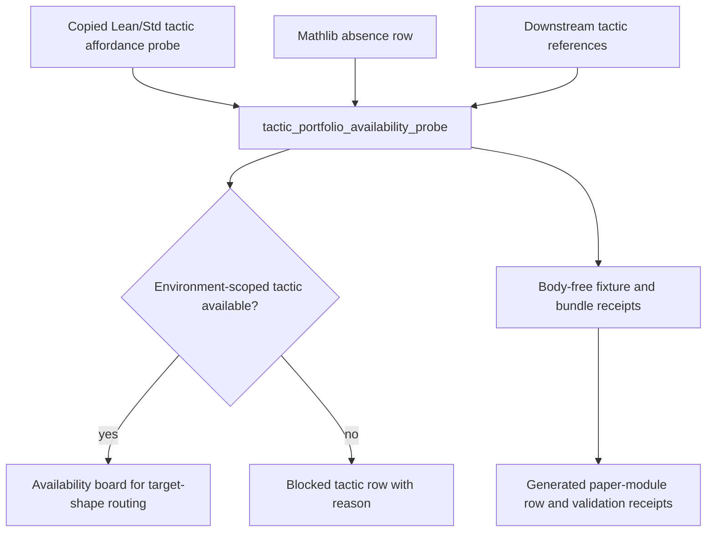

# Tactic Portfolio Availability Probe

`tactic_portfolio_availability_probe` is the public organ that turns tactic
callability into an explicit artifact before routing or proof search treats a
tactic as usable.

The fixture is copied from real non-secret macro substrate: the 2026-05-11
`PROVER_PROOF_STATE_SEARCH_CURRICULUM` smoke run's Lean/Std tactic affordance
probe. It records compile-status rows for `rfl`, `decide`, `omega`, `simp`,
`simp_all`, `grind`, `native_decide`, and `aesop`, with source digests for the
run-level affordance probe, the `portfolio_core_v0` tactic availability artifact,
and the paired corpus-readiness boundary. The Mathlib-dependent `aesop` row is
marked `environment_fail` because the paired environment probe reports
`mathlib_lake_project_import_available=false`.

The organ validates:

- every tactic has an environment-scoped `compile_status`;
- Mathlib-dependent tactics are not marked available without a passing Mathlib
  import probe;
- downstream consumers reference only tactics present in the probe portfolio;
- proof bodies, raw provider payloads, benchmark claims, release authority, and
  private paths stay out of the public artifact.

The generated board is a callability map, not proof evidence. It can make
target-shape routing cheaper and more honest, but it cannot prove a goal, widen
Lean/Lake authority, call providers, claim benchmark performance, or authorize
release.

The receipt contract reports
`body_material_status=copied_non_secret_macro_body_with_provenance`,
`tactic_availability_status=real_lean_std_tactic_affordance_probe_rows`, source
digests, target refs, and `secret_exclusion_scan`. It does not use body-redaction
or private-state-scan grammar as product evidence.

## JSON Capsule Binding

- Source row: `core/paper_module_capsules.json::paper_modules[40:paper_module.tactic_portfolio_availability]`
- `source_authority: json_capsule`
- This Markdown is a reader projection. The generated Mermaid projection is
  `available_from_capsule_edges`, and the generated Atlas projection is
  `linked_from_capsule_edges`; both are navigation projections derived from the
  capsule row rather than source authority.
- The proof boundary is the copied Lean/Std tactic affordance probe, tactic
  compile-status rows, Mathlib absence row, downstream tactic-reference checks,
  source digests, secret-exclusion checks, negative cases, and validation receipts.
- The authority ceiling excludes proof evidence, theorem correctness,
  Lean/Lake authority expansion, provider calls, benchmark-performance claims,
  private path export, release authority, and treating tactic callability as
  proof quality.

## Structured Lattice Bindings

The generated JSON row currently contributes 18 relationship edges with no
unpopulated selective relations.

The Mermaid projection is `available_from_capsule_edges`; the Atlas projection
is `linked_from_capsule_edges`. This page treats those generated navigation
surfaces as capsule-derived projections while explaining the resolved
tactic-availability organ, code-locus, law, and sibling-paper links.

## Shape



The flow is deliberately smaller than the generated doctrine-lattice graph. The
generated Mermaid projection proves capsule edge availability; this reader
diagram shows the behavior boundary a human should inspect before treating a
tactic as routeable.

## Reader Evidence Routing

Read this page in four passes:

1. Start with the capsule source row at
   `core/paper_module_capsules.json::paper_modules[40:paper_module.tactic_portfolio_availability]`.
   It names the public organ subject, mechanism subject, resolved code locus,
   Microcosm concept, governing principles, axioms, and sibling paper-module
   dependencies that generate the relationship edges.
2. Open `paper_modules/tactic_portfolio_availability.json` next, not as a
   hand-authored source, but as the builder-owned proof that the capsule row
   currently resolves to 18 relationship edges, zero unpopulated selective
   relations, generated Mermaid `available_from_capsule_edges`, generated Atlas
   `linked_from_capsule_edges`, and `source_authority: json_capsule`.
3. Inspect the runtime substrate at
   `src/microcosm_core/organs/tactic_portfolio_availability_probe.py`. The
   load-bearing symbols are `run`, `run_availability_bundle`,
   `_build_result`, `_write_receipts`, `EXPECTED_NEGATIVE_CASES`, and
   `AUTHORITY_CEILING`; those are the code-loci symbols that make the paper
   module about an executable organ instead of a prose topic.
4. Reproduce the evidence floor with the fixture input
   `fixtures/first_wave/tactic_portfolio_availability_probe/input`, the exported
   bundle
   `examples/tactic_portfolio_availability_probe/exported_tactic_portfolio_availability_bundle`,
   the focused test `tests/test_tactic_portfolio_availability_probe.py`, and
   the paper-module corpus check. Treat the receipts as environment-scoped
   tactic-callability evidence only; validation receipts do not widen the proof
   boundary, authority ceiling, release posture, provider posture, or benchmark
   posture.

## Claim Ceiling

The JSON capsule and generated row prove only environment-scoped tactic
callability evidence: copied Lean/Std tactic affordance rows, compile-status
rows, Mathlib absence evidence, downstream tactic-reference checks, source
digests, secret-exclusion checks, negative cases, and validation receipts. They
do not prove theorem correctness, expand Lean or Lake authority, call providers,
claim benchmark performance, export private paths, authorize release or
publication, or treat tactic callability as proof quality.

## Authority Ceiling

This organ is environment-scoped tactic callability evidence only. It does not prove theorem correctness, expand Lean/Lake authority, call providers, claim benchmark performance, export private paths, authorize release, or treat tactic callability as proof quality.

## Prior Art Grounding

The module is patterned after feature-detection probes and proof-assistant
tactic inventories. GNU Autoconf's configure workflow established the habit of
testing local capability before relying on it; Lean's tactic documentation
shows that tactic use is environment- and goal-sensitive, so a tactic name is
not enough to justify downstream routing. This organ applies that older probe
discipline to Microcosm: it records which tactics were callable in the observed
Lean/Std environment and preserves Mathlib-dependent absence as evidence,
without treating callability as proof quality.

Prior-art anchors:

- GNU Autoconf feature/configuration probing:
  https://ftp.gnu.org/old-gnu/Manuals/autoconf-2.57/html_chapter/autoconf.html
- Lean 4 tactic documentation:
  https://lean-lang.org/theorem_proving_in_lean4/Tactics/

Primary commands:

```bash
PYTHONPATH=src python3 -m microcosm_core.organs.tactic_portfolio_availability_probe run --input fixtures/first_wave/tactic_portfolio_availability_probe/input --out receipts/first_wave/tactic_portfolio_availability_probe --acceptance-out receipts/acceptance/first_wave/tactic_portfolio_availability_probe_fixture_acceptance.json
PYTHONPATH=src python3 -m microcosm_core.cli tactic-portfolio-availability-probe run-availability-bundle --input examples/tactic_portfolio_availability_probe/exported_tactic_portfolio_availability_bundle --out receipts/runtime_shell/demo_project/organs/tactic_portfolio_availability_probe
```

## Receipt Expectations

A complete local receipt includes the fixture command, the exported-bundle command, the focused pytest, the paper-module corpus check, and generated-row proof showing 18 relationship edges, Mermaid `available_from_capsule_edges`, Atlas `linked_from_capsule_edges`, `source_authority: json_capsule`, and no unpopulated selective relations.

Fixture and bundle receipts must preserve copied Lean/Std tactic affordance rows, environment-scoped compile statuses, Mathlib absence evidence, downstream tactic-reference checks, source digests, secret-exclusion checks, negative cases, and the authority ceiling that excludes proof evidence, theorem correctness, Lean/Lake authority expansion, provider calls, benchmark-performance claims, private path export, release authority, and treating tactic callability as proof quality.

## Validation Receipt Path

From `microcosm-substrate/`, reproduce this page's proof boundary with
temporary receipts:

```bash
PYTHONPATH=src ../repo-python -m microcosm_core.organs.tactic_portfolio_availability_probe run --input fixtures/first_wave/tactic_portfolio_availability_probe/input --out /tmp/microcosm-tactic-portfolio-availability-probe --acceptance-out /tmp/microcosm-tactic-portfolio-availability-probe-acceptance.json
PYTHONPATH=src ../repo-python -m microcosm_core.organs.tactic_portfolio_availability_probe run-availability-bundle --input examples/tactic_portfolio_availability_probe/exported_tactic_portfolio_availability_bundle --out /tmp/microcosm-tactic-portfolio-availability-bundle
../repo-pytest microcosm-substrate/tests/test_tactic_portfolio_availability_probe.py
PYTHONPATH=src ../repo-python scripts/build_doctrine_projection.py --check-paper-module-corpus
jq -r '[.id, (.relationships.edges | length), ((.relationships.unpopulated_selective_relations // []) | length), .paper_module_payload.generated_projections.mermaid.status, .paper_module_payload.generated_projections.atlas_card.status] | @tsv' paper_modules/tactic_portfolio_availability.json
```

The expected projection row is `paper_module.tactic_portfolio_availability`
with 18 generated relationship edges, no unpopulated selective relations,
Mermaid status `available_from_capsule_edges`, and Atlas status
`linked_from_capsule_edges`. These checks validate environment-scoped tactic
availability rows and bundle receipts only; they do not turn callability into
proof quality, benchmark performance, Mathlib proof authority, or release
authority.
