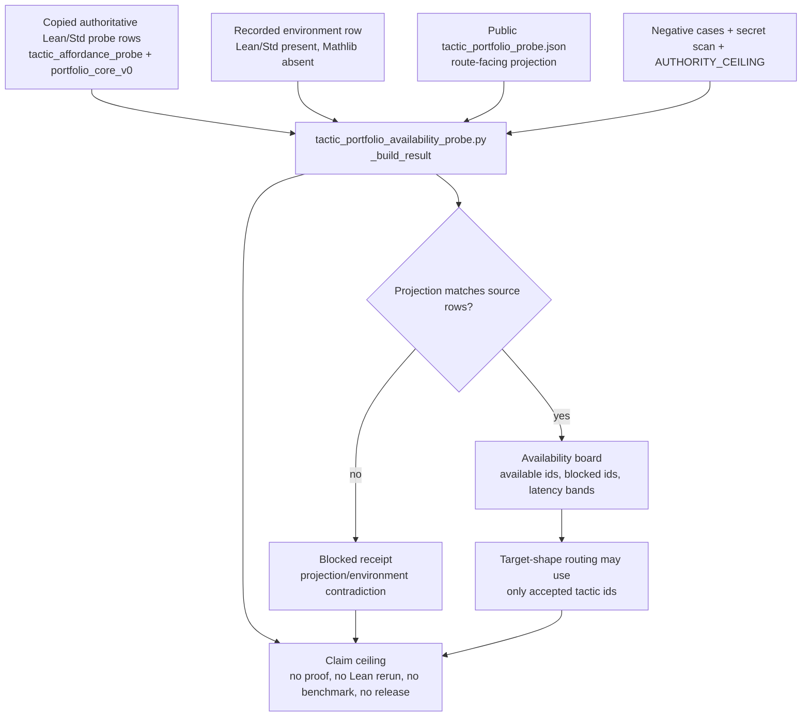

# Tactic Portfolio Availability Probe

## Abstract

`tactic_portfolio_availability_probe` is a Microcosm formal-math boundary
mechanism: it turns recorded Lean/Std tactic callability into an explicit
availability artifact before target-shape routing or proof-search language can
treat a tactic as usable.

The mechanism is not a theorem prover and does not rerun Lean or Lake in this
paper-module lane. Its evidence floor is copied non-secret PROVER smoke-run
material from the 2026-05-11 tactic affordance probe, including eight tactic
rows, Lean/Std toolchain metadata, a Mathlib absence probe, copied public Lean
probe snippets, source digests, public-relative receipts, negative-case
rejections, and exported-bundle validation. Its claim ceiling is deliberately
lower than proof authority: availability means environment-scoped callability
evidence, not theorem correctness, proof quality, benchmark performance,
provider authority, release authority, or publication readiness.

## Telos

The telos is to make formal-proof availability honest. A downstream route may
want to say "try `simp`", "block `aesop` until Mathlib is available", or
"reject a public projection that still says `rfl` is available after the source
row moved." Those claims need an artifact with a freshness basis and a
recompute contract, not a prose memory that some tactic once worked.

This probe supplies that artifact. It forces tactic routing to consult recorded
compile-status rows, Mathlib availability state, and source/projection
consistency before treating tactic names as live options.

## Authority And Path Boundary

This file is a reader-facing technical paper for the probe organ. The
capsule-backed paper-module source of authority remains
`paper_module.tactic_portfolio_availability`, whose current Markdown projection
is `paper_modules/tactic_portfolio_availability.md` and whose generated JSON
instance is `paper_modules/tactic_portfolio_availability.json`.

The governing standard is
`standards/std_microcosm_tactic_portfolio_availability_probe.json`. Its
authority boundary is real Lean/Std affordance references, not proof authority.
The runtime locus is
`src/microcosm_core/organs/tactic_portfolio_availability_probe.py`, especially
`run`, `run_availability_bundle`, `_build_result`, `_write_receipts`,
`EXPECTED_NEGATIVE_CASES`, and `AUTHORITY_CEILING`.

## Reader Proof Boundary

Read this page as a public reader projection over a legacy Microcosm
paper-module row. The generated JSON row for this slug reports
`paper_module_payload.source_authority: legacy_markdown_projection`, with source
ref `paper_modules/tactic_portfolio_availability_probe.md`. Mermaid and Atlas
projections must remain `blocked_required_subject_gap` until this slug receives
its own JSON capsule row with a resolving subject, concept route, and code locus.
The current source locus is
`src/microcosm_core/organs/tactic_portfolio_availability_probe.py`; it is real
runtime evidence, but this Markdown cannot create a capsule edge without
claiming JSON capsule authority.

## JSON Capsule Binding

This file is not itself JSON-capsule-backed. The existing capsule-backed module
is `paper_module.tactic_portfolio_availability`, whose capsule explains the
probe organ and mechanism through `paper_modules/tactic_portfolio_availability.md`.
The separate generated row `paper_module.tactic_portfolio_availability_probe`
exists as a legacy Markdown projection so readers can see the remaining
required-subject gap instead of inferring it from a sibling capsule.

## JSON Capsule Boundary

This paper module remains a legacy Markdown projection in the generated
paper-module corpus.

- Current authority: `paper_module_payload.source_authority` remains
  `legacy_markdown_projection`, and the sidecar keeps Mermaid/Atlas edges
  blocked by the required-subject gap.
- Current proof: the tactic probe organ, copied source artifacts, receipts, and
  focused tests make the runtime inspectable to readers, but this Markdown is
  not a JSON-capsule-backed source row yet.
- Re-entry: after the capsule owner admits this slug as a distinct paper module
  or deliberately suppresses the duplicate legacy row, append
  `paper_module.tactic_portfolio_availability_probe` to
  `core/paper_module_capsules.json` with resolved subjects, resolved code loci,
  concept refs, and the same anti-claim ceiling, then regenerate with
  `scripts/build_doctrine_projection.py --write-paper-module-corpus`.

Until that exact re-entry condition lands, this Markdown explains the proof
boundary without claiming JSON capsule authority. It must not invent a subject
row yet, source Mermaid edges, source Atlas cards, prove tactic correctness,
authorize Lean/Lake execution, authorize release, or count as aggregate
doctrine-lattice coverage.

## Capsule Re-entry Packet

- current source authority: generated JSON reports
  `paper_module_payload.source_authority: legacy_markdown_projection`.
- generated row source ref:
  `paper_modules/tactic_portfolio_availability_probe.md`.
- current generated projection status: Mermaid `blocked_required_subject_gap`;
  Atlas `blocked_required_subject_gap`.
- resolved source locus:
  `src/microcosm_core/organs/tactic_portfolio_availability_probe.py`.
- missing authority edge: this slug has no direct JSON capsule subject, concept
  route, or code-locus edge, so the capsule registry must not invent a subject
  row yet.
- re-entry condition: either admit a distinct source capsule for
  `paper_module.tactic_portfolio_availability_probe` or remove/suppress the
  duplicate legacy Markdown row through the owner builder, then verify Mermaid,
  Atlas, required-subject-gap, and aggregate doctrine-lattice coverage outputs.
- authority ceiling: this Markdown provides reader evidence only; it does not
  source proof authority, runtime correctness, Lean/Lake execution authority,
  release claims, source mutation authority, or aggregate doctrine-lattice
  completion.

## Evidence Model

The probe consumes a fixture and an exported public bundle:

- `fixtures/first_wave/tactic_portfolio_availability_probe/input`
- `examples/tactic_portfolio_availability_probe/exported_tactic_portfolio_availability_bundle`

The positive tactic portfolio contains eight recorded rows:

| Tactic | Recorded status | Boundary |
|---|---|---|
| `rfl` | `compile_pass` | Lean/Std probe row only |
| `decide` | `compile_pass` | Lean/Std probe row only |
| `omega` | `compile_pass` | Lean/Std probe row only |
| `simp` | `compile_pass` | Lean/Std probe row only |
| `simp_all` | `compile_pass` | Lean/Std probe row only |
| `grind` | `compile_pass` | Lean/Std probe row only |
| `native_decide` | `compile_pass` | Lean/Std probe row only |
| `aesop` | `environment_fail` | Mathlib-dependent row blocked by Mathlib absence |

The environment row records Lean 4.29.1 / Lake 5.0.0 metadata and
`mathlib_lake_project_import_available=false`, with the diagnostic "unknown
module prefix Mathlib". That row is a dated recorded probe result, not a
permanent statement about all future Lean environments. Under AX-10, the row
must be read as `<value, as_of, basis, rederive>`: the value is Mathlib absence
in the recorded environment; the basis is the copied source artifacts and
digests; rederivation requires rerunning or refreshing the authoritative probe
lane, not editing this paper.

## Technical Mechanism

The runtime reducer builds an availability result from three public input
families:

1. `tactic_portfolio_probe.json` carries the public projection of tactic rows.
2. `environment_probe.json` carries Lean/Lake and Mathlib availability state.
3. `availability_policy.json` carries the policy and authority ceiling.

It then compares those projections against copied authoritative source
artifacts under `source_artifacts/`, including:

- `tactic_affordance_probe.json`
- `tactic_affordance_probe/portfolio_core_v0/tactic_portfolio_availability.json`
- `corpus_readiness.json`
- copied public Lean probe bodies for `rfl`, `decide`, `omega`, `simp`,
  `simp_all`, `grind`, `native_decide`, `aesop`, `mathlib_probe`, and
  `trace_state_probe`

The result is accepted only when the public projection agrees with the copied
authoritative rows, every tactic row has an environment-scoped
`compile_status`, Mathlib-dependent tactics are not promoted without a passing
Mathlib probe, downstream tactic references name only portfolio tactics, the
expected negative cases are observed, receipts remain public-relative, and the
secret-exclusion scan does not find blocking private material.

## Availability Perturbation Contract

The load-bearing property is not the original happy-path count. The
load-bearing property is that the probe moves when the authoritative source
moves and rejects stale public projections.

Focused tests encode the contract:

- `test_tactic_portfolio_availability_moves_when_authoritative_source_row_changes`
  mutates the copied authoritative `rfl` source row to fail, updates the public
  projection consistently, and expects the result to pass with `rfl` removed
  from available tactics.
- `test_tactic_portfolio_availability_rejects_baked_labels_when_authoritative_source_moves`
  mutates the copied authoritative `rfl` source row while leaving stale public
  labels in place, and expects `TACTIC_PORTFOLIO_PUBLIC_PROJECTION_CONTRADICTION`.
- `test_tactic_portfolio_availability_ignores_stale_public_failure_classifier`
  proves that a stale public failure label does not become source authority.
- `test_tactic_portfolio_availability_moves_when_authoritative_duration_changes`
  proves that duration summaries move with authoritative duration rows; the
  latency profile stays environment-scoped and never becomes benchmark
  authority.
- `test_tactic_portfolio_availability_rejects_stale_public_duration_projection`
  rejects projection-only duration drift.
- `test_tactic_portfolio_availability_rejects_stale_public_environment_projection`
  mutates the authoritative Mathlib environment to available while leaving
  stale public environment/projected tactic rows in conflict, and expects
  source/projection contradiction errors.

The existing receipt
`receipts/first_wave/tactic_portfolio_availability_probe/mutated_real_rejection_receipt.json`
records this floor as a committed mutated-real rejection and input-dependence
receipt: the organ derives availability from copied source artifacts, not from
baked public labels.

## Prior Art Grounding

This page is grounded in the accepted
`paper_module.tactic_portfolio_availability` capsule, the
`mechanism.tactic_portfolio_availability_probe.validates_public_tactic_availability_projection`
mechanism row, `standards/std_microcosm_tactic_portfolio_availability_probe.json`,
the first-wave fixture receipts, and the exported tactic availability bundle. It
does not use that sibling capsule to claim this legacy slug is ready.

## Diagram



The diagram is explanatory. The generated lattice Mermaid for the capsule row
remains a builder-owned projection derived from
`paper_modules/tactic_portfolio_availability.json`, not from this hand-authored
Mermaid block.

## Relation To Formal-Math Mechanisms

The generated capsule row for `paper_module.tactic_portfolio_availability`
binds this probe to `concept.formal_math_and_proof_witness_bundle`, principles
`P-1`, `P-2`, `P-3`, `P-6`, `P-8`, and `P-9`, and axioms `AX-1`, `AX-2`,
`AX-5`, `AX-7`, and `AX-8`. The technical reading is:

- `AX-1` and `AX-2` keep tactic availability as an explicit artifact rather
  than an implicit agent belief.
- `AX-5` and `AX-7` keep source rows and generated projections separate, so
  stale projections fail instead of becoming authority.
- `AX-8` keeps downstream routing from silently re-enabling unavailable
  tactics.
- `AX-10`, though not listed in the current capsule row, is the relevant live
  freshness rule for this paper: recorded availability rows require a basis and
  a rederive path before they can be treated as current live state.

Sibling mechanisms explain where the artifact sits:

- `corpus_readiness_mathlib_absence_gate` supplies the Mathlib absence boundary.
- `formal_math_readiness_gate` composes tactic availability into the broader
  formal-math readiness board.
- `target_shape_tactic_routing_gate` consumes accepted tactic ids and rejects
  routes that allow unavailable tactics.
- `formal_math_verifier_trace_repair_loop`,
  `undeclared_library_prior_symbol_classifier`, and `verifier_lab_kernel` can
  use the availability evidence as accounting, but not as proof correctness.

## Public-Safe Body Handling

The public-safe body floor is refs, digests, counts, source/target equality,
negative-case ids, public-relative receipt paths, and authority ceilings. The
bundle may carry copied non-secret source artifacts for inspection, but receipts
and reader-facing cards must not export private theorem proof bodies, provider
payload bodies, browser or HUD live-access state, account/session state,
recipient-send state, credentials, raw private paths, or body excerpts from
forbidden negative fixtures.

This is why the tests check public-relative receipt paths, absence of absolute
user-home and repo-local paths, omission of forbidden proof-body fixture text,
and absence of generic `body`/`matched_excerpt` keys in emitted receipts.

## Limitations

The probe proves availability accounting, not formal mathematics. It can show
that recorded tactic rows were internally consistent with copied source
artifacts, that Mathlib-dependent tactics were blocked under a recorded Mathlib
absence result, and that stale public projections were rejected. It cannot show
that any theorem is correct, that a tactic will solve a future goal, that a
future Lean/Lake environment has the same availability state, or that the
recorded latency rows have benchmark meaning.

The live/recorded boundary is central. The copied 2026-05-11 Lean/Std probe
rows are real recorded evidence, but this paper does not claim that Lean or
Lake were executed during this authoring pass. Any live-mathlib claim requires
a fresh environment probe with its own receipt and invalidation basis.

The paper-module boundary is also central. This file technicalizes the probe
organ. It does not flip source authority away from the JSON capsule row for
`paper_module.tactic_portfolio_availability`, does not edit generated
projections, and does not authorize publication or release.

## Claim Ceiling

This paper may claim:

- copied non-secret Lean/Std tactic-affordance evidence exists for eight tactic
  rows;
- seven rows are recorded as compile-pass in the observed environment;
- `aesop` is recorded as unavailable because the paired Mathlib environment
  probe failed;
- public projections must agree with copied authoritative source rows;
- mutated-real source-row and stale-projection tests exercise the recompute
  contract;
- receipts preserve public-relative, body-free, secret-exclusion-safe evidence.

This paper may not claim:

- theorem correctness;
- proof quality;
- proof-search success;
- live Lean or Lake execution during this paper pass;
- current Mathlib availability beyond the recorded probe;
- benchmark performance;
- provider-call authority;
- private proof-body import;
- release or publication approval;
- whole-system correctness.

## Reproducibility

From `microcosm-substrate/`, the focused validation route is:

```bash
PYTHONPATH=src ../repo-python -m microcosm_core.organs.tactic_portfolio_availability_probe run --input fixtures/first_wave/tactic_portfolio_availability_probe/input --out /tmp/microcosm-tactic-portfolio-availability-probe --acceptance-out /tmp/microcosm-tactic-portfolio-availability-probe-acceptance.json
PYTHONPATH=src ../repo-python -m microcosm_core.organs.tactic_portfolio_availability_probe run-availability-bundle --input examples/tactic_portfolio_availability_probe/exported_tactic_portfolio_availability_bundle --out /tmp/microcosm-tactic-portfolio-availability-bundle
../repo-pytest microcosm-substrate/tests/test_tactic_portfolio_availability_probe.py
PYTHONPATH=src ../repo-python scripts/build_doctrine_projection.py --check-paper-module-corpus
```

## Validation Receipt Path

The reader-verifiable receipt path is the same focused route above:

```bash
PYTHONPATH=src ../repo-python -m microcosm_core.organs.tactic_portfolio_availability_probe run --input fixtures/first_wave/tactic_portfolio_availability_probe/input --out /tmp/microcosm-tactic-portfolio-availability-probe --acceptance-out /tmp/microcosm-tactic-portfolio-availability-probe-acceptance.json
PYTHONPATH=src ../repo-pytest tests/test_tactic_portfolio_availability_probe.py -q
PYTHONPATH=src ../repo-python scripts/build_doctrine_projection.py --check-paper-module-corpus
```

For the generated capsule row, the current projection check is:

```bash
jq -r '[.id, (.relationships.edges | length), ((.relationships.unpopulated_selective_relations // []) | length), .paper_module_payload.generated_projections.mermaid.status, .paper_module_payload.generated_projections.atlas_card.status] | @tsv' paper_modules/tactic_portfolio_availability.json
```

Expected generated-row posture at this HEAD: `paper_module.tactic_portfolio_availability`,
18 relationship edges, no unpopulated selective relations, Mermaid
`available_from_capsule_edges`, Atlas `linked_from_capsule_edges`, and
`source_authority: json_capsule`.
