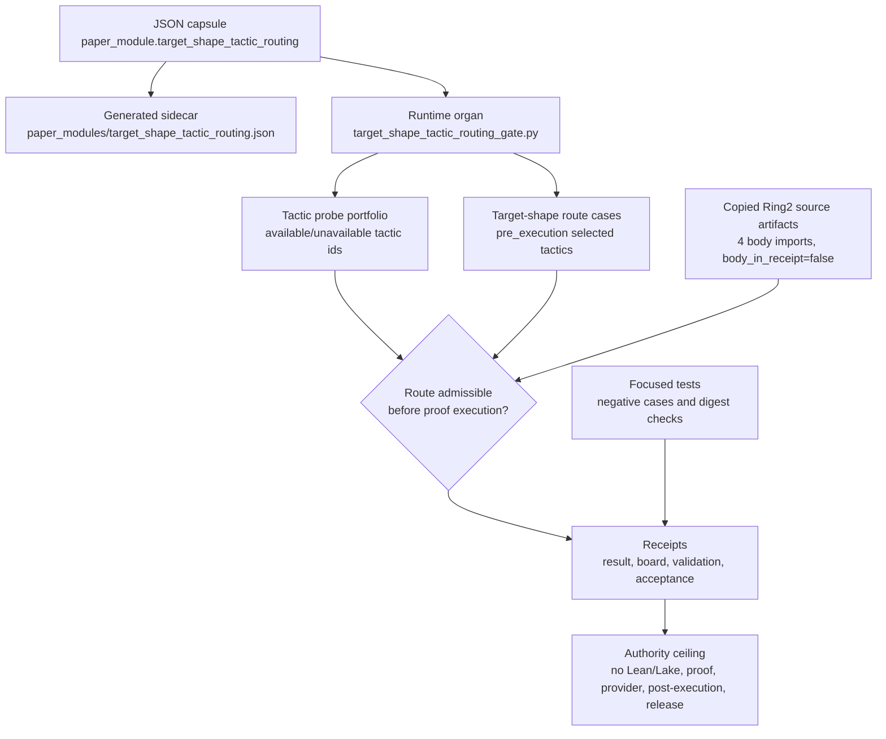

# Target Shape Tactic Routing

`target_shape_tactic_routing_gate` is the public Microcosm organ for the
pre-execution tactic admissibility layer.

It turns real problem-domain, failure-class, and graph-update candidate
refs from the formal-math evaluation pipeline into route decisions: which tactics are admitted, which are rejected as
unavailable, which are rejected as unprobed, and which are rejected because they
do not match the declared goal shape.

## Authority Ceiling

This organ does not run Lean or Lake and does not prove a target. It validates
only the non-secret route references that must exist before a proof attempt in
the formal-math evaluation and premise-retrieval pipeline: tactic probe
availability, target-shape route cases, selected tactic ids, failure-class refs,
graph-update candidate refs, and negative-case receipts.

Forbidden outputs include proof bodies, provider bodies, post-execution route
selection, Lean receipt claims, provider calls, release claims, and
Mathlib-dependent proof authority.

## JSON Capsule Binding

- Source row: `core/paper_module_capsules.json::paper_modules[41:paper_module.target_shape_tactic_routing]`
- `source_authority: json_capsule`
- This Markdown is a reader projection. The generated Mermaid projection is
  `available_from_capsule_edges`, and the generated Atlas projection is
  `linked_from_capsule_edges`; both are navigation projections derived from the
  capsule row rather than source authority.
- The proof boundary is the non-secret Ring2 route refs, tactic probe
  availability, target-shape cases, selected tactic ids, failure-class refs,
  graph-update candidate refs, negative-case receipts, and validation receipts.
- The authority ceiling excludes Lean or Lake execution, proof correctness,
  proof bodies, provider bodies, post-execution route selection, provider calls,
  Mathlib-dependent proof authority, publication, and release authority.

## Structured Lattice Bindings

The generated JSON row currently contributes 20 relationship edges with no
unpopulated selective relations.

The Mermaid projection is `available_from_capsule_edges`; the Atlas projection
is `linked_from_capsule_edges`. This page treats those generated navigation
surfaces as capsule-derived projections while explaining the resolved tactic
routing organ, code-locus, law, and sibling-paper links.

## Shape



## Technical Mechanism

The named mechanism
`mechanism.target_shape_tactic_routing_gate.validates_public_tactic_routing_boundary`
is a fail-closed scorer over two public input planes: the tactic probe portfolio
and the target-shape route cases. `_build_result` loads the fixture or exported
bundle payloads, scans the inputs and copied source artifacts for forbidden
body material, derives known/available/unavailable tactic sets, scores every
route case, checks copied Ring2 source-artifact digests, and emits body-free
result, board, validation, and acceptance receipts.

For each route case, `_decision_for_tactic` rejects a candidate before selection
if the tactic id is absent from the public probe portfolio, marked unavailable,
or outside the case's declared `allowed_tactic_ids`. Only a tactic that is
probed, available, and target-shape-admissible can receive
`TARGET_SHAPE_ADMISSIBLE`. `_shape_preferred_selection` then applies the local
target-shape preference map, records the unknown-shape default fallback when no
specific map exists, and records the preferred-unavailable fallback when the
first preferred tactic is known but not usable. `_route_integrity_findings`
turns any unavailable admission, unprobed admission, post-execution route, or
declared-selection mismatch into typed findings.

The proof consumer is
`tests/test_target_shape_tactic_routing_gate.py`: it asserts seven
`pre_execution` route cases, shape-preferred selection for the real Ring2 cases,
unknown-shape and unavailable-Mathlib fallback behavior, rejection of mutated
shape and availability inputs, exported-bundle acceptance, four copied source
artifacts with digest verification, compact card omission of the full routing
board, and receipt text without private paths or body fields. Those tests
consume the same fixture and exported-bundle surfaces named by the mechanism
row, so this page's evidence is the runnable route-reference and receipt
contract rather than a prose-only claim.

The governing lattice stays explicit: the capsule binds the module to
`concept.formal_math_and_proof_witness_bundle`, principles `P-1`, `P-2`, `P-3`,
`P-6`, `P-8`, and `P-9`, axioms `AX-1`, `AX-2`, `AX-5`, `AX-7`, and `AX-8`, and
dependency modules for tactic portfolio availability, formal-math readiness,
proof-diagnostic evidence, verifier-trace repair, and formal evidence-cell
anchor resolution. The standard narrows that lattice to one allowed claim:
public pre-execution route cases may admit only tactics that were both probed
and available before proof execution. The same standard forbids widening this
mechanism into theorem correctness, Lean/Lake execution, provider calls, proof
or provider body export, post-execution route authority, publication authority,
or release authority.

Evidence/accounting:

- Capsule authority: `core/paper_module_capsules.json::paper_modules[41:paper_module.target_shape_tactic_routing]` names `source_authority: json_capsule`, subjects `organ:target_shape_tactic_routing_gate` and `mechanism.target_shape_tactic_routing_gate.validates_public_tactic_routing_boundary`, the resolved code locus `src/microcosm_core/organs/target_shape_tactic_routing_gate.py`, and generated projection statuses `mermaid.status: available_from_capsule_edges` plus `atlas_card.status: linked_from_capsule_edges`.
- Generated sidecar: `paper_modules/target_shape_tactic_routing.json` carries `relationships.edges` for the capsule subjects, concept/principle/axiom refs, dependency paper modules, and code locus; `relationships.unpopulated_selective_relations: []`; and anti-claims that the JSON row does not prove runtime correctness, release readiness, or whole-system completeness.
- Runtime contract: `standards/std_microcosm_target_shape_tactic_routing_gate.json` limits the allowed claim to pre-execution tactic admission from probed, available tactics; its `required_fields` bind `tactic_portfolio_availability.tactics[].tactic_id`, `availability_status`, `target_shape_routes.route_cases[].target_shape`, `allowed_tactic_ids`, `selected_tactic_id`, and `route_stage`.
- Source-body accounting: `examples/target_shape_tactic_routing_gate/exported_target_shape_tactic_routing_bundle/source_module_manifest.json` records `source_import_class: copied_non_secret_macro_body`, `module_count: 4`, `body_in_receipt: false`, three `verified_public_safe_private_path_rewrite` rows, and one `exact_copy` row.
- Fixture/bundle behavior: `examples/target_shape_tactic_routing_gate/exported_target_shape_tactic_routing_bundle/target_shape_routes.json` has seven `pre_execution` route cases, while `tactic_portfolio_availability.json` marks `decide`, `omega`, `simp_all`, and `rfl` available and `aesop` unavailable.
- Receipt floor: `receipts/first_wave/target_shape_tactic_routing_gate/target_shape_tactic_routing_result.json`, `target_shape_tactic_routing_board.json`, `target_shape_tactic_routing_validation_receipt.json`, and `receipts/acceptance/first_wave/target_shape_tactic_routing_gate_fixture_acceptance.json` report `status: pass`, `route_case_count: 7`, `copied_source_artifact_count: 4`, `source_artifacts_pass: true`, `missing_negative_cases: []`, `secret_exclusion_scan.blocking_hit_count: 0`, and authority flags with Lean/Lake, proof, provider, post-execution routing, and release authority set false.
- Test boundary: `tests/test_target_shape_tactic_routing_gate.py` checks observed negative cases, shape-preferred selection, unknown-shape and Mathlib-unavailable fallback, exported-bundle acceptance, source-module digest verification, compact card omission of full boards, and receipt output without private paths or body fields.

## Reader Evidence Routing

Read this module as a pre-execution admissibility gate, not as a proof attempt.
The primary reader path is:

- Start with the problem-domain, failure-class, graph-update candidate, and
  tactic-probe refs in the fixture input. They are the public route evidence the
  gate is allowed to inspect before any Lean/Lake work in the formal-math
  evaluation and premise-retrieval pipeline.
- Compare each target-shape route case against the selected tactic ids and
  rejection reasons: admitted tactics must match both the declared goal shape and
  the public availability probe.
- Inspect negative cases before the happy path. The important behavior is that
  unavailable tactics, unprobed tactics, proof/provider body leakage,
  post-execution routing, and release overclaims all fail closed.
- Use the generated JSON sidecar only for structural lattice proof: it confirms
  subjects, code loci, doctrine refs, and dependency edges; it does not prove
  the tactic route can solve the target.

## Claim Ceiling

This module covers only public pre-execution tactic routing evidence: the
non-secret route references used before a formal proof attempt, tactic probe
availability, target-shape cases, selected tactic ids, failure-class refs,
graph-update candidate refs, negative-case receipts, source-module digest
evidence, and validation receipts. It does not run Lean or Lake, prove theorem
correctness, export proof bodies or provider bodies, authorize post-execution
route selection, call providers, claim Mathlib-dependent proof authority,
authorize publication, authorize release, or prove whole-system correctness.

## Runtime Surfaces

```bash
PYTHONPATH=src python3 -m microcosm_core.organs.target_shape_tactic_routing_gate run --input fixtures/first_wave/target_shape_tactic_routing_gate/input --out receipts/first_wave/target_shape_tactic_routing_gate
PYTHONPATH=src python3 -m microcosm_core.cli target-shape-tactic-routing-gate run-routing-bundle --input examples/target_shape_tactic_routing_gate/exported_target_shape_tactic_routing_bundle --out receipts/runtime_shell/demo_project/organs/target_shape_tactic_routing_gate
```

## Receipt Expectations

A complete local receipt should bind four layers:

- Runtime receipt files from the fixture command and exported-bundle command.
- Focused organ pytest for target-shape route cases, selected tactic ids,
  unavailable/unprobed tactic refusals, negative cases, source-module digest
  evidence, and compact card shape.
- Paper-module corpus validation from
  `build_doctrine_projection.py --check-paper-module-corpus`.
- Generated-row proof from `paper_modules/target_shape_tactic_routing.json`
  showing 20 relationship edges, Mermaid `available_from_capsule_edges`, Atlas
  `linked_from_capsule_edges`, `source_authority: json_capsule`, and no
  unpopulated selective relations.

Fixture and bundle receipts must preserve tactic probe availability,
target-shape route cases, selected tactic ids, failure-class refs,
graph-update candidate refs, negative-case receipts, source-module digest
evidence, and the authority ceiling that excludes Lean/Lake execution, proof
correctness, proof bodies, provider bodies, post-execution route selection,
provider calls, Mathlib-dependent proof authority, publication, and release
authority.

## Validation Receipt Path

From `microcosm-substrate/`, reproduce this page's proof boundary with
temporary receipts:

```bash
PYTHONPATH=src ../repo-python -m microcosm_core.organs.target_shape_tactic_routing_gate run --input fixtures/first_wave/target_shape_tactic_routing_gate/input --out /tmp/microcosm-target-shape-tactic-routing-gate --acceptance-out /tmp/microcosm-target-shape-tactic-routing-gate-acceptance.json
PYTHONPATH=src ../repo-python -m microcosm_core.organs.target_shape_tactic_routing_gate run-routing-bundle --input examples/target_shape_tactic_routing_gate/exported_target_shape_tactic_routing_bundle --out /tmp/microcosm-target-shape-tactic-routing-bundle
../repo-pytest microcosm-substrate/tests/test_target_shape_tactic_routing_gate.py
PYTHONPATH=src ../repo-python scripts/build_doctrine_projection.py --check-paper-module-corpus
```

These checks validate route-reference fixture and bundle receipts only; they do
not widen the no-Lean/no-proof authority ceiling.

## Re-Entry Conditions

Re-enter through the JSON capsule lane only if the module needs new subjects,
doctrine refs, dependency edges, or code loci. That lane owns
`core/paper_module_capsules.json` and regenerated JSON/Atlas/Mermaid surfaces,
so it must wait for an exclusive projection-owner session before writing.

Re-enter through the Markdown-only lane when the capsule and sidecar already
agree but the reader evidence, receipt routing, or authority-ceiling prose needs
sharpening. That lane owns only `paper_modules/target_shape_tactic_routing.md`
and must preserve the `## JSON Capsule Binding` heading plus the generated
projection statuses named above.

## Negative Cases

- `unavailable_tactic_admitted` rejects an `aesop` route while Mathlib is absent.
- `unprobed_tactic_allowed` rejects a tactic absent from the public probe portfolio.
- `proof_body_leakage` rejects proof/provider/Lean body fields.
- `post_execution_route` rejects route selection after execution evidence.
- `release_overclaim` rejects proof, provider, Lean/Lake, publication, and release authority overclaims.

## Prior Art Grounding

The routing layer follows established proof-search and policy-gating patterns:
match a goal shape to methods that are known to be available before spending
runtime on them. Lean's tactic documentation supplies the local proof-assistant
context for goal-directed tactic choice, while Isabelle/Sledgehammer represents
a mature prior-art pattern for selecting external provers and relevant facts
from a goal. Microcosm narrows that idea to a pre-execution admissibility
filter: target shape, allowed references, and current tactic availability must
line up before a tactic route can be exported.

Prior-art anchors:

- Lean 4 tactic documentation:
  https://lean-lang.org/theorem_proving_in_lean4/Tactics/
- Isabelle Sledgehammer user guide:
  https://isabelle.in.tum.de/doc/sledgehammer.pdf

## Why It Matters

After corpus readiness and strategy scoring, Microcosm needs a visible gate that
prevents wasted or misleading proof attempts. This organ shows that gate over
the formal-math evaluation and premise-retrieval pipeline already feeding
verifier repair, evidence anchoring, and proof diagnostics: a tactic is not
tried just because it exists; it is admitted only when the target shape and the
public availability probe both allow it.
