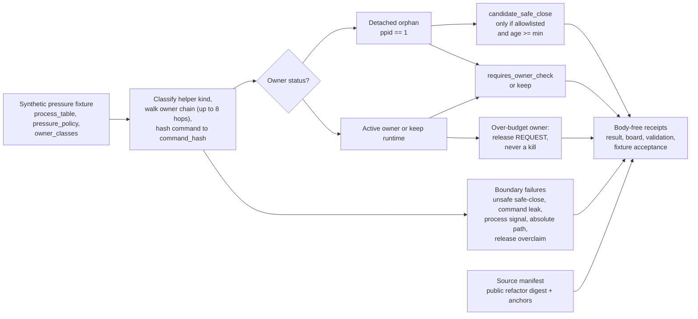

# Tool-Server Pressure Inventory

`tool_server_pressure_inventory` is the public read-only import of the macro
helper-process pressure inventory pattern from `tools/meta/control/orphan_reaper.py`.
It validates the classifier without exposing live host state: fixtures inject a
synthetic ps-shaped process table, synthetic helper-kind policy rows, and a
synthetic owner-status taxonomy.

The accepted organ keeps the load-bearing mechanism:

- parse helper processes from ps-shaped rows
- classify helper kind and owner status
- distinguish detached orphan candidates from active-owner descendants
- emit release requests for over-budget active owners
- keep all rows digest-only through `command_hash`

The exported runtime bundle carries a source module manifest plus a public-safe
source-faithful refactor body under `source_modules/tools/meta/control/`. That
manifest records the macro source ref, target digest, source digest, relation,
material class, and required anchors. Receipts carry refs, hashes, counts, and
verdicts only; they do not inline the copied/refactored body.

The organ rejects seven boundary failures:

- active-owner descendants marked as safe-close candidates
- unknown-owner processes marked as safe-close candidates
- detached processes younger than the minimum age marked safe-close
- process-signal results on the public surface
- live command bodies instead of digest-only rows
- absolute host paths
- active-owner release requests that overclaim kill or termination

## Purpose

Long-running agent sessions leave helper processes behind: MCP servers, dev
servers, keepalives. Over time these accumulate and the host slows down. The
obvious fix is a reaper that walks the process table and kills stale helpers,
and the macro tool this organ is ported from does exactly that. But a reaper is
dangerous. The hard case is telling a genuinely abandoned process apart from a
helper that a live session is still using. Kill the wrong one and you break the
work in flight.

This organ answers a single question: given a process table, which helper
processes are safe to close, and which must be left alone because a live owner
still depends on them? It does so by reconstructing each process's owner chain.
A helper whose parent is `launchd` (`ppid == 1`) has been detached from any
session and is a candidate. A helper that still traces back through a live agent
session is not. The decision is deliberately narrow: a process is a safe-close
candidate only when it is detached, its kind is on an allowlist, and it has been
idle past a minimum age. Everything else routes to "needs an owner check" or
"keep".

What is unusual is the second half of the design. When an active owner is over
its helper budget, the organ does not propose a kill. It emits a release
*request*: a row that asks the owning session to release or reuse its own lease.
The inventory is explicitly not a kill list. The central invariant, enforced by
an audit pass over the organ's own output, is that an active-owner descendant
can never become a safe-close candidate.

The public version keeps that classifier and that invariant but removes every
actuator. There is no `os.kill`, no signal, no live `ps` call. Input is
synthetic process text from a fixture, rows carry a `command_hash` rather than a
command line, and a redaction guard rejects any fixture that smuggles an
absolute path, a live command body, or a process-signal claim onto the public
surface. The result is the safety reasoning of a reaper presented as a
read-only validator, with the part that could actually harm a host left out.

## Shape



## Technical Mechanism

The runtime mechanism is an actuatorless port of the read-only pressure path in
`tools/meta/control/orphan_reaper.py`. The organ receives injected synthetic
`ps_text` plus `pressure_policy.json` and `owner_classes.json`; it never shells
out to `ps`, imports process-control modules, or sends signals. `_parse_process_rows`
normalizes process rows, `_process_kind` maps command tokens to helper kinds,
and `_owner_status_for_process` walks parent links up to eight hops to separate
`launchd_detached` helpers from active owner chains and keep runtimes.

The decision law is deliberately narrow. `_inventory_owner_and_decision` emits
`candidate_safe_close` only when a helper is detached (`ppid == 1`), its kind is
allowlisted, and its age exceeds the configured threshold. Active-owner chains,
unknown parents, young detached helpers, and keep runtimes route to
`requires_owner_check` or `keep`. Over-budget active-owner groups are summarized
by `_active_owner_pressure_groups`, but the emitted
`helper_owner_release_request_v1` can only ask the owner to release the helper;
it cannot claim that Microcosm killed, terminated, or safely closed a process.

The source-open body floor and the public receipts enforce the same membrane.
`_source_module_manifest_result` verifies the exported
`orphan_reaper_pressure_inventory_public_refactor` body, its
`source_faithful_public_refactor` relation, target digest, and required anchors.
`_redaction_findings` rejects command previews, absolute host paths, and
process-signal claims before receipt writing. The result is a pressure
classifier with executable evidence and a hard no-actuator boundary, not a live
host cleanup tool.

## Governing Lattice Relation

The generated row binds this module to mechanism
`mechanism.tool_server_pressure_inventory.validates_public_tool_server_pressure_inventory`,
concept `concept.import_projection_and_drift_control_bundle`, principles
`P-2`, `P-4`, `P-6`, and `P-9`, axioms `AX-3`, `AX-5`, `AX-7`, and `AX-8`, and
the runtime code locus
`src/microcosm_core/organs/tool_server_pressure_inventory.py`. Those edges make
the module a Microcosm import-and-validation proof: source-open digest evidence
is allowed, while private host state, process control, provider authority,
release approval, and whole-system correctness stay outside the claim.

The dependency edges to `mission_transaction_work_spine`,
`provider_context_recipe_budget`, and
`world_model_projection_drift_control_room` define the reader route. This
module can explain how a helper-pressure row becomes a body-free receipt and an
owner-release request, but it must borrow mission-landing, provider-budget, and
projection-drift boundaries from those sibling modules before any broader
operational or release claim is made.

## JSON Capsule Binding

This binding section names the JSON capsule as the source authority; the
structured lattice details below are reader-facing projection context.

## Structured Lattice Bindings

- Source row: `core/paper_module_capsules.json::paper_modules[50:paper_module.tool_server_pressure_inventory]`
- Generated JSON instance: `paper_modules/tool_server_pressure_inventory.json`
- `source_authority: json_capsule`
- Subject edge: `paper_module.tool_server_pressure_inventory` explains organ
  `tool_server_pressure_inventory` and mechanism
  `mechanism.tool_server_pressure_inventory.validates_public_tool_server_pressure_inventory`.
- Runtime code locus:
  `src/microcosm_core/organs/tool_server_pressure_inventory.py` with `run`,
  `run_pressure_bundle`, `build_tool_server_pressure_inventory`,
  `build_pressure_hygiene_relief_receipt`, `_redaction_findings`,
  `_build_result`, `_write_receipts`, `EXPECTED_NEGATIVE_CASES`, and
  `AUTHORITY_CEILING`.
- Standard: `standards/std_microcosm_tool_server_pressure_inventory.json`.
- Fixture manifest:
  `core/fixture_manifests/tool_server_pressure_inventory.fixture_manifest.json`.
- Focused tests: `tests/test_tool_server_pressure_inventory.py`.
- This Markdown is a reader projection. The generated Mermaid projection is
  `available_from_capsule_edges`, and the generated Atlas projection is
  `linked_from_capsule_edges`; both are navigation projections derived from the
  capsule row rather than source authority.
- The proof boundary is the synthetic ps-shaped process table, helper-kind
  policy rows, owner-status taxonomy, digest-only command rows, copied
  public-safe source body, boundary-failure cases, source manifest, and
  validation receipts.
- The authority ceiling excludes live process inspection, process signals,
  host-state mutation, provider authority, release authority, private account or
  session export, and whole-system correctness.

## Claim Ceiling

This module can claim that synthetic process-table fixtures, owner-status policy
rows, digest-only command rows, boundary-failure cases, source manifest evidence,
and body-free receipts validate a public tool-server pressure classifier. It
cannot claim live host inspection, process signaling, safe cleanup authority,
host-state mutation, provider authority, release authority, private account or
session export, or whole-system correctness.

## Public Site Availability Boundary

This module is public-safe to expose through the existing Microcosm public site
feed because its source authority is the JSON capsule plus body-free fixture,
source-manifest, standard, organ, mechanism, and receipt refs. The site builder
may index this Markdown, `paper_modules/tool_server_pressure_inventory.json`,
the capsule row, the generated Atlas linkage, search records, object-map rows,
and component/paper-module cards as reader routes. Those outputs remain
projections; they are not the authority for the fixture, source-open body floor,
or claim ceiling.

The public page should keep the same boundary as the capsule and receipts:
synthetic process rows, owner-status policy, digest-only command hashes,
negative-case names, target/source digests, required anchors, and authority
ceilings are allowed; live process tables, command bodies, host paths,
provider/session state, credentials, private macro bodies, process signals, and
release or cleanup authority are not. If generated site outputs drift after this
source page changes, refresh them only through the existing public-site builder
after source coupling is clean.

## Reader Evidence Routing

Read the positive fixture as pressure-inventory evidence, not host process
control. The fixture supplies `process_table.json`, `pressure_policy.json`, and
`owner_classes.json`; the organ classifies helper kind, owner status, detached
safe-close eligibility, active-owner descendants, keep runtimes, and
over-budget active-owner groups. Active-owner pressure becomes a release request
row, not a kill, terminate, or signal action.

Read the negative cases as the authority ceiling. The required failures are
`active_owner_kill_candidate.json`, `unknown_owner_kill.json`,
`premature_safe_close.json`, `process_signal_sent.json`,
`command_preview_leak.json`, `absolute_path_leak.json`, and
`owner_release_overclaim.json`. They prove the public surface rejects unsafe
safe-close candidates, live command bodies, absolute host paths, process-signal
claims, and release-overclaim language.

Read source-open evidence through the source module manifest. The exported
bundle includes one copied non-secret public refactor body at
`examples/tool_server_pressure_inventory/exported_tool_server_pressure_inventory_bundle/source_modules/tools/meta/control/orphan_reaper_pressure_inventory.py`.
The manifest binds source and target digests, declares
`source_faithful_public_refactor`, requires anchors such as
`build_tool_server_pressure_inventory`, `build_pressure_hygiene_relief_receipt`,
`no_process_signal_sent`, and `request_owner_release`, and keeps
`body_in_receipt` and `body_text_in_receipt` false.

## Named Proof Consumers

- Runtime fixture consumer:
  `microcosm_core.organs.tool_server_pressure_inventory run` consumes the
  synthetic pressure fixture and writes the result, board, validation receipt,
  and acceptance receipt.
- Source-body consumer:
  `microcosm_core.organs.tool_server_pressure_inventory run-pressure-bundle`
  consumes the exported source-module bundle and blocks on missing manifests,
  target-ref mismatch, digest mismatch, unsafe body classes, or redaction hits.
- Focused pytest consumer:
  `tests/test_tool_server_pressure_inventory.py` asserts every expected
  negative case, verifies that active-owner descendants are never safe-close
  candidates, checks owner-release requests instead of kill actions, scans the
  organ and public refactor AST for process-control imports or `.kill(...)`,
  validates target-ref/digest parity, and checks compact card omission receipts.
- Corpus consumer:
  `scripts/build_doctrine_projection.py --check-paper-module-corpus` keeps this
  reader projection inside the paper-module corpus without making generated
  Atlas or Mermaid projections the source authority.
- Claim-ceiling consumer:
  the standard
  `standards/std_microcosm_tool_server_pressure_inventory.json` and the
  authority ceiling in the organ require `process_signal_authority`,
  `live_process_table_read_authorized`, `host_mutation_authorized`,
  `release_authorized`, `provider_calls_authorized`, and
  `whole_system_correctness_claim` to remain false.

## Prior Art Grounding

This organ draws on process-inventory, tool-server, and owner-reference
patterns. `psutil.process_iter()` is a common API for iterating over process
metadata without shelling out to ad hoc `ps` parsing. Kubernetes garbage
collection uses owner references to distinguish objects that may be collected
from objects still owned by live controllers. The Model Context Protocol's
tool-server model gives the local "server exposes callable tools" shape. The
Microcosm version keeps the result deliberately weaker: synthetic rows are
classified for pressure and safe-close eligibility, but the organ does not read
live host state or send signals.

Prior-art anchors:

- psutil process iteration:
  https://psutil.readthedocs.io/en/latest/#psutil.process_iter
- Kubernetes owner-reference garbage collection:
  https://kubernetes.io/docs/concepts/architecture/garbage-collection/
- Model Context Protocol tool servers:
  https://modelcontextprotocol.io/docs/concepts/tools

Authority ceiling: this is projection and validation only. It does not read the
live process table, signal processes, mutate host state, authorize release, call
providers, export private account/session state, or prove whole-system
correctness.

## Receipt Expectations

- `tool_server_pressure_inventory_result.json` records the typed inventory
  result and passes only when rows stay synthetic, digest-only, and inside the
  no-actuator membrane.
- `tool_server_pressure_inventory_board.json` is the reader board for pressure
  rows and owner groups; it is evidence of classification, not host mutation.
- `tool_server_pressure_inventory_validation_receipt.json` records `status:
  pass`, zero validation issues, `body_in_receipt: false`, and an authority
  ceiling that denies live process reads, process-signal authority, host
  mutation, provider calls, release authority, source mutation authority,
  private-data equivalence, and whole-system correctness.
- `tool_server_pressure_inventory_fixture_acceptance.json` is the fixture
  acceptance receipt; it carries the same no-live-process and no-release
  boundary as the validation receipt.
- The exported runtime bundle validation receipt is valid only as source
  manifest and bundle-shape evidence; it must not inline copied macro body text
  or turn a synthetic pressure fixture into live cleanup authority.

## Validation Receipt Path

From `microcosm-substrate`, validate with receipts under `/tmp`:

```bash
PYTHONPATH=src ../repo-python -m microcosm_core.organs.tool_server_pressure_inventory run --input fixtures/first_wave/tool_server_pressure_inventory/input --out /tmp/microcosm-tool-server-pressure-inventory/fixture --acceptance-out /tmp/microcosm-tool-server-pressure-inventory/acceptance.json --card
PYTHONPATH=src ../repo-python -m microcosm_core.organs.tool_server_pressure_inventory run-pressure-bundle --input examples/tool_server_pressure_inventory/exported_tool_server_pressure_inventory_bundle --out /tmp/microcosm-tool-server-pressure-inventory/bundle --card
PYTHONPATH=src ../repo-python -m pytest -p no:cacheprovider tests/test_tool_server_pressure_inventory.py -q
PYTHONPATH=src ../repo-python scripts/build_doctrine_projection.py --check-paper-module-corpus
PYTHONPATH=src ../repo-python scripts/build_doctrine_projection.py --check
```

Passing receipts prove synthetic inventory classification and source-manifest
shape only; they do not read live host process state, send process signals,
mutate host state, authorize cleanup, call providers, or certify release
readiness. A diagram view and an atlas entry are generated for this module from
the same source row.
