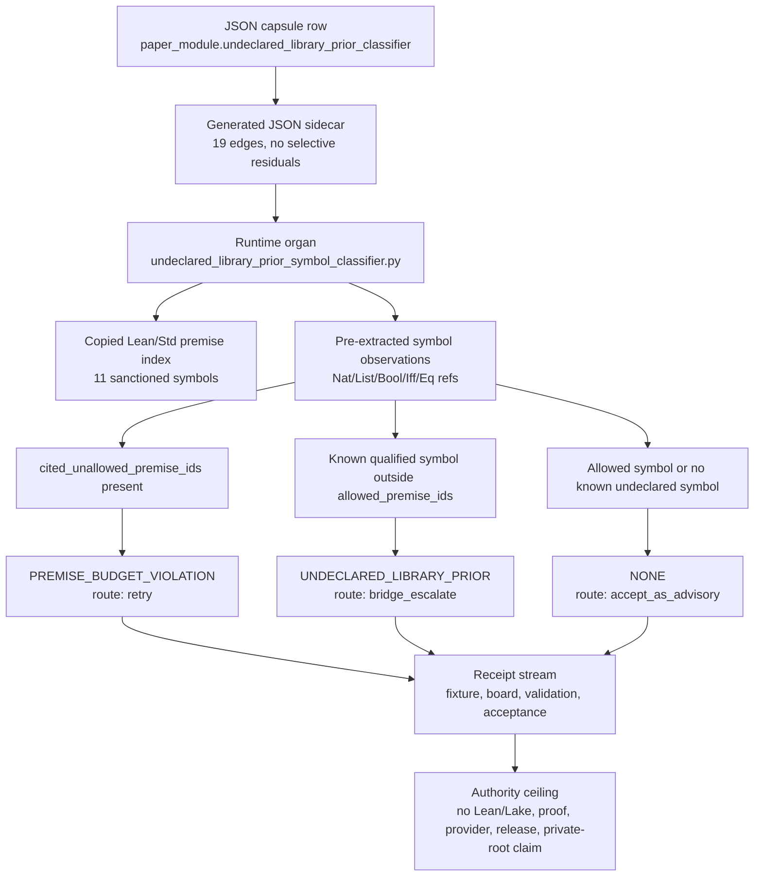

# Undeclared Library Prior Symbol Classifier

This module is the Microcosm projection of the formal-prover rule that a
Lean-accepted proof can still violate the evaluation contract when it uses a
real library symbol that was not in the allowed premise set. It is a
provenance-bearing symbol-boundary organ, not a proof checker.

The fixture carries copied non-secret Lean/Std premise rows from the real
Ring2 premise-index substrate and real Ring2 problem ids / candidate artifact
digests for the symbol-boundary examples. It records extracted qualified symbol
refs and classifies a known symbol outside `allowed_premise_ids` as
`UNDECLARED_LIBRARY_PRIOR`. If `cited_unallowed_premise_ids` is present, that
explicit budget violation takes precedence and routes as
`PREMISE_BUDGET_VIOLATION`.

The source chain is digest-bearing: the real Ring2 premise index
`sha256:c78b176388a5e81bd8a785950e7db0c9a65fd38e556515134146163b48604df1`,
Ring2 run summary
`sha256:93304410f32d40f5cad1c161c1d01a5d6f353ee10b7cf3fecbaaf7b068b43008`,
copied Lean/Std premise fixture
`sha256:0be36ba5b75b40d2ede2d90cefa5181829420df7abbae216d18282b92a30f869`,
and the adjacent corpus-readiness / tactic-availability receipts anchor the
Mathlib-absent toolchain boundary.

The exported runtime bundle carries a source-open body floor at
`examples/undeclared_library_prior_symbol_classifier/exported_symbol_classifier_bundle/source_module_manifest.json`.
It imports the reducer and batch-calibration builder source bodies exactly,
plus public-safe run bodies for the Ring2 premise index, Ring2 run summary,
recipe policy metrics, and receipt reduction matrix. The two run-state bodies
are path-normalized to `<repo-root>` and `<lean-toolchain-root>` while
preserving source and target digests, line counts, byte counts, and required
anchors.

## Purpose

A theorem prover can return a proof that Lean accepts, yet that proof can still
break the rules of the evaluation it was run under. The usual reason is simple:
the proof reached for a library lemma that the recipe never put on the table. The
symbol is real and the proof is sound, but the run quietly used a fact it was not
allowed to assume. This organ answers one question. Given a set of premises a
candidate was allowed to use and the symbols it actually reached for, did it cite
a known library symbol that was outside that allowed set?

The unusual choice is what the classifier refuses to do. It does not run Lean, it
does not read the proof body, and it does not treat the standard library as an
implicit allowlist where anything that exists is fair game. It works only from a
copied premise index and a list of symbol observations that were extracted
beforehand, and it compares the two. That keeps the check cheap and keeps proof
material out of the public receipt, but it also means the allowed set is closed by
construction: a symbol is admissible only because a premise row names it, never
because it happens to live in Lean's standard library.

The check also separates two failure modes that are easy to confuse. An explicit
budget breach, where the candidate names a premise id the recipe did not allow, is
not the same as a residual breach, where the candidate used an allowed-looking
symbol that turns out to be undeclared. The first is settled directly from the
cited ids and takes precedence; the second is what the symbol comparison is for.
Treating both as one class would either over-escalate honest retries or let
genuine out-of-recipe library use slip through as a budget note. Keeping them
apart is the point.

## Shape



## Technical Mechanism

The organ separates three questions that are easy to conflate in proof
evaluation: whether a candidate explicitly cites a premise outside the recipe,
whether it uses a known Lean/Std symbol that was not in the allowed premise
set, and whether the theorem is actually correct. Only the first two are in
scope. `validate_premise_index` builds the closed allowlist from copied
Lean/Std premise rows, `validate_symbol_observations` reads pre-extracted
qualified symbol observations, and `_classify_row` applies the precedence rule:
`cited_unallowed_premise_ids` yields `PREMISE_BUDGET_VIOLATION` with `retry`;
otherwise a known qualified symbol outside `allowed_premise_ids` yields
`UNDECLARED_LIBRARY_PRIOR` with `bridge_escalate`; clean or unknown observations
remain advisory. The classifier records observed symbols and computed/asserted
classes, but it never evaluates proof bodies or runs Lean.

The exported-bundle mechanism is a second boundary rather than a richer proof.
`validate_source_module_manifest` requires
`source_module_manifest.json`, rejects manifest or row-level
`body_in_receipt: true`, verifies six declared public-safe body imports against
source/target digests, line counts, byte counts, required anchors, material
classes, and relation type, and keeps path-normalized Ring2 run-state bodies
separate from exact copied reducer bodies. `secret_exclusion_scan` then checks
the declared public fixture and bundle inputs for proof-body, provider-payload,
private-ref, and host-path sentinel classes. `_write_receipts` writes result,
board, validation, and acceptance receipts; `result_card` deliberately emits a
small pass/fail card that omits source modules, source digests, proof bodies,
private source refs, secret-scan detail, and authority-ceiling bodies. This is
why the module can be source-open about the symbol-boundary substrate without
becoming a proof-body export.

The governing lattice follows the same separation. The capsule binds the organ
to `mechanism.undeclared_library_prior_symbol_classifier.validates_public_symbol_boundary`,
`concept.formal_math_and_proof_witness_bundle`, principles `P-1`, `P-2`,
`P-3`, `P-6`, `P-8`, and `P-9`, and axioms `AX-1`, `AX-2`, `AX-5`, `AX-7`,
`AX-8`, and `AX-10`. The technical claim is therefore limited to public
symbol-budget classification over copied, digest-bearing premise evidence. It
does not prove theorem truth, Mathlib availability, Lean/Lake execution,
release readiness, provider correctness, or complete library allowlisting.

## Reader Evidence Routing

Start with the capsule row, not this prose:
`core/paper_module_capsules.json::paper_modules[56:paper_module.undeclared_library_prior_classifier]`
is the source authority that names the organ subject
`undeclared_library_prior_symbol_classifier`, the mechanism
`mechanism.undeclared_library_prior_symbol_classifier.validates_public_symbol_boundary`,
the code locus
`src/microcosm_core/organs/undeclared_library_prior_symbol_classifier.py`,
the concept `concept.formal_math_and_proof_witness_bundle`, the governing
principles `P-1`, `P-2`, `P-3`, `P-6`, `P-8`, and `P-9`, the axioms
`AX-1`, `AX-2`, `AX-5`, `AX-7`, `AX-8`, and `AX-10`, and the sibling modules
`paper_module.corpus_readiness_mathlib_absence_gate`,
`paper_module.tactic_portfolio_availability`, and
`paper_module.lean_std_premise_index`.

Then read the generated sidecar
`paper_modules/undeclared_library_prior_classifier.json`. It is the parity
projection from the capsule, carrying `source_authority: json_capsule`,
Mermaid `available_from_capsule_edges`, Atlas
`linked_from_capsule_edges`, 19 generated relationship edges, and no
unpopulated selective relations. The sidecar is evidence that the reader page is
wired into the doctrine lattice; it is not theorem-correctness, release, or
runtime-correctness authority.

For runtime behavior, inspect
`src/microcosm_core/organs/undeclared_library_prior_symbol_classifier.py`.
The named locus validates projection protocol, premise index, classifier policy,
source-module manifest, symbol observations, secret-exclusion scan, result
construction, receipt writing, and result-card compaction. The load-bearing
classifier rule is `_classify_row`: explicit `cited_unallowed_premise_ids`
short-circuit as `PREMISE_BUDGET_VIOLATION` with `retry`; otherwise a known
qualified Lean/Std symbol outside `allowed_premise_ids` classifies as
`UNDECLARED_LIBRARY_PRIOR` with `bridge_escalate`. Negative cases reject proof
bodies, private source refs, theorem-correctness overclaims, allowed-symbol
false positives, unqualified-token overclaims, and missing escalation.

For public fixture evidence, use
`fixtures/first_wave/undeclared_library_prior_symbol_classifier/input/`. The
fixture carries the premise index, classifier policy, projection protocol,
symbol observations, and the seven negative-case files named by
`EXPECTED_NEGATIVE_CASES`. For exported source-open body-floor evidence, use
`examples/undeclared_library_prior_symbol_classifier/exported_symbol_classifier_bundle/source_module_manifest.json`.
That manifest verifies six public-safe source body imports: reducer source,
batch-calibration builder source, path-normalized Ring2 premise-index state,
path-normalized Ring2 run summary, recipe policy metrics, and receipt reduction
matrix. The manifest keeps `body_in_receipt` false and checks source/target
digests plus required anchors; it does not export proof bodies, provider payload
bodies, account/session state, raw operator voice, or private macro-root bodies.

For receipts, read
`receipts/first_wave/undeclared_library_prior_symbol_classifier/undeclared_library_prior_symbol_classifier_result.json`,
`receipts/first_wave/undeclared_library_prior_symbol_classifier/undeclared_library_prior_symbol_classifier_board.json`,
`receipts/first_wave/undeclared_library_prior_symbol_classifier/undeclared_library_prior_symbol_classifier_validation_receipt.json`,
and
`receipts/acceptance/first_wave/undeclared_library_prior_symbol_classifier_fixture_acceptance.json`.
The fixture receipt reports 11 premises, 3 classifications, 1 undeclared-library
prior, 1 premise-budget-precedence case, 1 bridge escalation, 1 retry, zero
blocking secret-exclusion hits, and the anti-claim that this is not Lean/Lake,
proof-correctness, provider, private-ref, whole-library-allowlist, or release
authority.

Focused regression coverage lives in
`tests/test_undeclared_library_prior_symbol_classifier.py`. It runs both the
fixture command and `run-symbol-bundle`, checks public-relative receipts,
verifies digest/manifest boundary failures, and confirms the compact card
reuses a fresh receipt without exporting source modules, body ids, secret-scan
details, source digests, proof bodies, or private source refs. The paper-module
coverage contract also names this module in
`tests/test_microcosm_paper_module_coverage_contract.py`; that is route
coverage evidence, not runtime proof evidence.

## Named Proof Consumers

The fixture consumer is
`microcosm_core.organs.undeclared_library_prior_symbol_classifier run` over
`fixtures/first_wave/undeclared_library_prior_symbol_classifier/input`. It
proves the public example still classifies 11 copied premise rows and 3 symbol
observations into one undeclared-library-prior escalation, one premise-budget
retry, and one advisory clean case, while the expected negative cases cover
proof-body export, private refs, theorem-correctness overclaim, allowed-symbol
false positives, unqualified-token overclaims, and missing escalation.

The exported-bundle consumer is
`microcosm_core.organs.undeclared_library_prior_symbol_classifier run-symbol-bundle`
over
`examples/undeclared_library_prior_symbol_classifier/exported_symbol_classifier_bundle`.
It proves the six source-open body imports remain digest/size/anchor checked
and public-safe, including the exact copied reducer and calibration-builder
bodies plus path-normalized Ring2 state, recipe metrics, and reduction-matrix
bodies. It is the consumer that catches source-module digest drift and
manifest-boundary violations; it does not certify theorem correctness.

The focused regression consumer is
`tests/test_undeclared_library_prior_symbol_classifier.py`. It ties the fixture
and bundle commands to public-relative receipts, source-module digest mismatch
blocking, manifest and row-level `body_in_receipt` rejection, compact-card
redaction, and fresh-card reuse. The corpus consumer is
`scripts/build_doctrine_projection.py --check-paper-module-corpus`, which proves
the Markdown remains part of the 98-module Microcosm paper-module corpus. That
corpus check is routing and projection parity evidence only; it is not a
runtime proof substitute.

## Public Mechanics

- Qualified symbol refs are restricted to `Nat`, `List`, `Bool`, `Iff`, and
  `Eq` namespaces in this public fixture.
- The closed premise index is an allowlist boundary, not permission to use the whole standard library.
- `UNDECLARED_LIBRARY_PRIOR` routes to `bridge_escalate` because the proof may be informative while still out of recipe.
- `PREMISE_BUDGET_VIOLATION` routes to `retry` and short-circuits the residual symbol classifier.
- Receipts expose ids, candidate artifact digests, symbols, counts, failure
  classes, source refs, source digests, and authority ceilings.
- `secret_exclusion_scan` records zero blocking hits for the declared sentinel
  classes in the public receipt stream; it is not a complete secret audit,
  release clearance, or proof that no private material exists anywhere.

## Prior Art Grounding

This classifier is grounded in formal-methods work on premise control and
library-aware proof search. Isabelle/Sledgehammer makes relevant-fact selection
an explicit part of automated proof search, and Lean/Mathlib practice makes
clear that accepted proofs can depend on a large library context. Microcosm uses
that insight as a boundary check: an accepted proof artifact is not enough if it
quietly used symbols outside the declared premise set. The organ classifies the
symbol-budget violation without judging theorem truth or exporting proof bodies.

Prior-art anchors:

- Isabelle Sledgehammer and relevant-fact selection:
  https://isabelle.in.tum.de/doc/sledgehammer.pdf
- Lean community Mathlib overview:
  https://leanprover-community.github.io/mathlib-overview.html
- Lean 4 tactic and proof environment context:
  https://lean-lang.org/theorem_proving_in_lean4/Tactics/

## Regression Cases

The forbidden proof-body, private-ref, allowed-symbol false-positive,
unqualified-token, and theorem-correctness cases are regression-only leakage
guards. They are not product evidence and cannot stand in for the copied
Lean/Std symbol-boundary substrate.

## JSON Capsule Binding

- Source row: `core/paper_module_capsules.json::paper_modules[56:paper_module.undeclared_library_prior_classifier]`
- `source_authority: json_capsule`
- This Markdown is a reader projection. The generated Mermaid projection is
  `available_from_capsule_edges`, and the generated Atlas projection is
  `linked_from_capsule_edges`; both are navigation projections derived from the
  capsule row rather than source authority.
- The proof boundary is the copied Lean/Std premise rows, real Ring2 ids and
  digests, allowed-premise boundary, extracted qualified symbol refs,
  `UNDECLARED_LIBRARY_PRIOR` and `PREMISE_BUDGET_VIOLATION` cases,
  source-open body floor, leakage regression cases, and validation receipts.
- The authority ceiling excludes theorem correctness, Lean or Lake execution,
  proof-body export, provider calls, private source refs, Mathlib availability
  claims, release authority, publication approval, private macro-root
  equivalence, and treating all Std or Mathlib declarations as allowed priors.

## Governing Lattice Relation

The governing relation is the path from capsule authority to a bounded proof
consumer. The source row binds this module to the
`undeclared_library_prior_symbol_classifier` organ, the mechanism
`mechanism.undeclared_library_prior_symbol_classifier.validates_public_symbol_boundary`,
the runtime locus
`src/microcosm_core/organs/undeclared_library_prior_symbol_classifier.py`, the
concept `concept.formal_math_and_proof_witness_bundle`, six principles, six
axioms, and the sibling paper modules for corpus readiness, tactic availability,
and Lean/Std premise indexing.

The principle layer explains why the classifier is a boundary organ rather than
a theorem authority. `P-1` requires the symbol class to be recomputed from
premise rows and observations instead of echoed from prose. `P-2` lowers the
claim to what the checker actually tests: allowed-premise and symbol-budget
classification. `P-3` concentrates trust in the small organ and source-module
manifest validators. `P-6` fails closed on missing or stale evidence. `P-8`
turns inadmissible computations into typed outcomes such as
`PREMISE_BUDGET_VIOLATION` and `UNDECLARED_LIBRARY_PRIOR`. `P-9` carries
source refs, target refs, digests, and body-material status through the fixture,
bundle, and receipt layers.

The axiom layer supplies the same ceiling in machine-checkable form. `AX-1`
requires derivation before assertion, so the page points to fixture and bundle
receipts instead of declaring theorem truth. `AX-2` keeps verification inside
kernelized validators. `AX-5` prevents an authority upgrade without stronger
evidence. `AX-7` allows typed partiality and refusal when the proof body,
private ref, or theorem-correctness claim is inadmissible. `AX-8` preserves
provenance while keeping proof/provider/private bodies out of public receipts.
`AX-10` requires the digest-bearing source-module and generated-row checks to be
fresh before this reader projection is treated as current.

The generated JSON row currently contributes 19 relationship edges with no
unpopulated selective relations. Those edges are evidence of route parity, not
new authority: the source authority remains the JSON capsule and the proof
authority remains the focused fixture, bundle, and regression consumers.

The Mermaid projection is `available_from_capsule_edges`; the Atlas projection
is `linked_from_capsule_edges`. This page treats those generated navigation
surfaces as capsule-derived projections while explaining the resolved
symbol-boundary organ, code-locus, law, and sibling-paper links.

## Claim Ceiling

The JSON capsule and generated row prove only allowed-premise and symbol-budget
classification evidence: copied Lean/Std premise rows, real Ring2 ids and
digests, extracted qualified symbol refs, declared budget-violation cases,
source-open body-floor digest evidence, leakage regression cases, negative
cases, and validation receipts. They do not prove theorem correctness, run Lean
or Lake, expose proof bodies, call providers, import private source refs, claim
Mathlib availability, treat all Std or Mathlib declarations as allowed priors,
authorize release, authorize publication, or prove whole-system correctness.
They also do not expose provider payload bodies, account/session state, raw
operator voice, or private macro-root bodies.

## Limitations

The classifier depends on copied, public-safe premise rows and pre-extracted
qualified symbol observations. It does not parse arbitrary Lean syntax, expand
imports, normalize proof terms, or run Lean/Lake to discover symbols. Unknown or
unqualified tokens are deliberately kept outside the positive
undeclared-library-prior claim unless the public observation and closed premise
index make the boundary explicit.

The public source-open body floor is a provenance check, not semantic
equivalence for the full private macro substrate. Exact copied bodies and
path-normalized run-state bodies are checked for source/target digests, line
counts, byte counts, and required anchors; that does not certify every upstream
private root, provider payload, account state, or operator context that may have
informed the original macro run.

The leakage and release boundaries are also scoped. `secret_exclusion_scan`
checks declared sentinel classes in the public fixture and bundle inputs, while
the focused pytest checks regression cases for proof-body export, private refs,
overclaims, and compact-card redaction. Those checks do not replace a whole-repo
secret audit, a publication review, theorem-correctness evidence, or a Mathlib
availability proof. The paper-module corpus and generated-row checks prove
routing parity only.

## Receipt Expectations

A complete local receipt includes the fixture command, the exported-bundle command, the focused pytest, the paper-module corpus check, and generated-row proof showing 19 relationship edges, Mermaid `available_from_capsule_edges`, Atlas `linked_from_capsule_edges`, `source_authority: json_capsule`, and no unpopulated selective relations.

Fixture and bundle receipts must preserve copied Lean/Std premise rows, real Ring2 ids and digests, the allowed-premise boundary, extracted qualified symbol refs, `UNDECLARED_LIBRARY_PRIOR` and `PREMISE_BUDGET_VIOLATION` cases, source-open body-floor digest evidence, leakage regression cases, and the authority ceiling that excludes theorem correctness, Lean/Lake execution, proof-body export, provider calls, private source refs, Mathlib availability claims, release authority, and treating all Std or Mathlib declarations as allowed priors.

## Validation Receipt Path

Run from `microcosm-substrate`:

```bash
PYTHONPATH=src ../repo-python -m microcosm_core.organs.undeclared_library_prior_symbol_classifier run \
  --input fixtures/first_wave/undeclared_library_prior_symbol_classifier/input \
  --out /tmp/microcosm-undeclared-library-prior-symbol-classifier/fixture \
  --acceptance-out /tmp/microcosm-undeclared-library-prior-symbol-classifier/acceptance.json \
  --card
PYTHONPATH=src ../repo-python -m microcosm_core.organs.undeclared_library_prior_symbol_classifier run-symbol-bundle \
  --input examples/undeclared_library_prior_symbol_classifier/exported_symbol_classifier_bundle \
  --out /tmp/microcosm-undeclared-library-prior-symbol-classifier/bundle \
  --card
PYTHONPATH=src ../repo-python -m pytest -p no:cacheprovider tests/test_undeclared_library_prior_symbol_classifier.py -q
PYTHONPATH=src ../repo-python scripts/build_doctrine_projection.py --check-paper-module-corpus
jq '{mermaid: .paper_module_payload.generated_projections.mermaid.status, atlas: .paper_module_payload.generated_projections.atlas_card.status, edge_count: (.relationships.edges | length)}' paper_modules/undeclared_library_prior_classifier.json
```

The expected capsule projection is Mermaid `available_from_capsule_edges`,
Atlas `linked_from_capsule_edges`, and 19 generated relationship edges with no
unpopulated selective relations. A green
receipt proves only the allowed-premise and symbol-budget classification
boundary; it does not prove theorem correctness, run Lean or Lake, expose proof
bodies, authorize provider calls, claim Mathlib availability, or broaden all Std
and Mathlib declarations into allowed priors.

## Authority Ceiling

This module is allowed-premise and symbol-budget classification evidence only. It does not prove theorem correctness, run Lean or Lake, expose proof bodies, call providers, import private source refs, treat all Std or Mathlib declarations as allowed priors, claim Mathlib availability, or authorize release.

## Anti-Claim

This module does not prove theorem correctness, run Lean or Lake, expose proof
bodies, call providers, import private source refs, treat all Std/Mathlib
declarations as allowed priors, claim Mathlib availability, or authorize
release.
