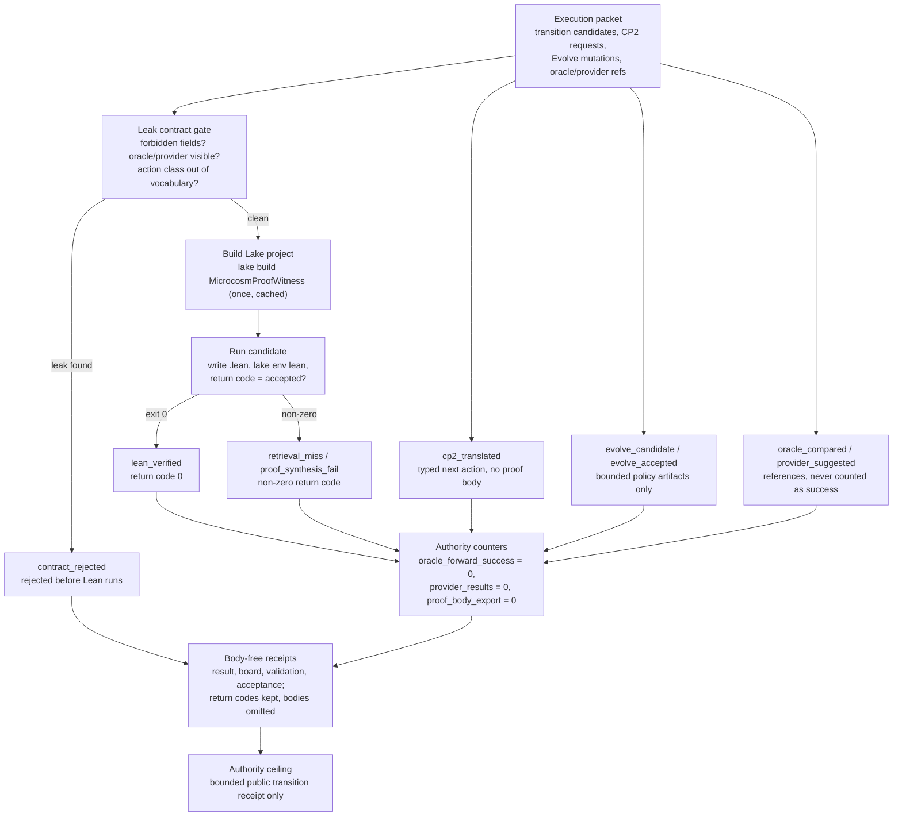

# Verifier Lab Execution Spine

`verifier_lab_execution_spine` is the public execution witness for the verifier
lab lane. It is narrower than `verifier_lab_kernel`: it actually runs bounded
Lean transition candidates in a throwaway Lake project, records the return code
of each run, and keeps every line of generated proof text and tool output out of
the receipt. A reader can then separate real execution evidence from overstated
proof claims.

The organ consumes a public execution packet with:

- transition candidates, each naming a problem id, a target shape, and one
  action class from a fixed vocabulary (`rfl`, `decide`, `cases`, `induction`,
  `exact_premise`, and similar);
- a small Lake project whose `MicrocosmProofWitness` library the organ builds
  once and reuses;
- CP2 translation requests that ask for the next typed action after a residual,
  and Evolve mutations that adjust bounded policy artifacts;
- negative fixtures that smuggle a proof body, an oracle sidecar, a provider
  hypothesis, or an unbounded source mutation into a row.

The organ writes one `.lean` file per transition, runs `lake env lean` on it,
and treats a zero exit code as `accepted`. It records the return code, the
action class, and the failure class, but never the proof text, the stdout body,
or the stderr body. The exported-bundle lane re-validates the same shape from a
copied source-module manifest without re-running Lean, so a third party can
inspect the bundle without a Lean toolchain installed.

## Purpose

Automated proof systems can blur how a result was obtained. A model can be handed
the answer by an oracle, or prompted with the proof by a provider, and still
report the result as if it had found the proof unaided. This organ exists to keep
that blurring out of the receipt. It answers one question: did a bounded
Lean candidate actually pass the verifier, with no help that the receipt is
hiding?

The discipline that makes this work is the separation of authority classes.
Every row lands in exactly one bucket: `lean_verified` for candidates the
verifier accepted, `oracle_compared` and `provider_suggested` for rows that
existed only as references, `cp2_translated` for the typed next-action layer,
`retrieval_miss` and `proof_synthesis_fail` for residuals, and
`contract_rejected` for anything that broke the leak rules. The unusual choice
is what does not happen: an oracle match never increments forward success, and
provider text is never counted as a proof. The counters
`oracle_forward_success_increment_count` and `provider_results_counted` are held
at zero by construction.

The second idea is that real execution and clean receipts are not in tension. A
candidate carrying `oracle_visible: true`, or a forbidden field such as
`proof_body` or `raw_tactic_script`, is rejected before Lean is ever invoked, so
the run cannot be contaminated. The transition then runs for real, and the
receipt carries the return code and the failure class while the proof text and
the stdout and stderr bodies stay out. The receipt is public evidence precisely
because the only things omitted are the things that would leak.

## JSON Capsule Binding

- Source row: `core/paper_module_capsules.json::paper_modules[44:paper_module.verifier_lab_execution_spine]`
- `source_authority: json_capsule`
- This Markdown is a reader projection. The generated Mermaid projection is
  `available_from_capsule_edges`, and the generated Atlas projection is
  `linked_from_capsule_edges`; both are navigation projections derived from the
  capsule row rather than source authority.
- The proof boundary is the public execution bundle, declared command intent,
  tool version facts, stdout and stderr classification, receipt refs, missing
  fact failures, overclaim failures, and validation receipts.
- The authority ceiling excludes general proof certification, Mathlib-dependent proof
  authority, proof-body export, benchmark solve-rate certification, provider
  calls, source mutation, hosted deployment, and release authority.

## Shape



Evidence/accounting used for this shape:

- `core/paper_module_capsules.json::paper_modules[44:paper_module.verifier_lab_execution_spine]` is the source capsule with `source_authority: json_capsule`, subjects for `organ: verifier_lab_execution_spine` and `mechanism.verifier_lab_execution_spine.validates_public_verifier_transition_witness`, resolved `code_loci.path: src/microcosm_core/organs/verifier_lab_execution_spine.py`, and generated projection statuses `available_from_capsule_edges` / `linked_from_capsule_edges`.
- `paper_modules/verifier_lab_execution_spine.json::paper_module_payload.source_row` carries the generated copy of that capsule row; `relationships.edges` has 19 entries and `relationships.unpopulated_selective_relations` is empty. This is readback evidence only, not an editable source.
- `core/organ_atlas.json::organs[18]` classifies the organ as `evidence_class: external_subprocess_witness`, names the first command, resolves the mechanism edge, and restates that the claim ceiling is bounded public Lean transition rows only.
- `src/microcosm_core/organs/verifier_lab_execution_spine.py` defines the runtime spine: `EXPECTED_NEGATIVE_CASES`, `AUTHORITY_CEILING`, `RECEIPT_TRANSPARENCY_CONTRACT`, `ANTI_CLAIM`, `validate_source_module_imports`, `_build_lake_project`, `_build_result`, `write_receipts`, `run`, and `run_execution_bundle`.
- `core/fixture_manifests/verifier_lab_execution_spine.fixture_manifest.json` names the fixture inputs, four expected negative cases, stable error codes, generated receipt paths, receipt field floor, and `body_copied_material_count: 5` for the exported body-floor lane.
- `examples/verifier_lab_execution_spine/exported_verifier_lab_execution_spine_bundle/source_module_manifest.json` records `module_count: 5`, `body_in_receipt: false`, exact-copy digest matches, validation refs, and blocked private/provider execution payload bodies.
- `receipts/acceptance/first_wave/verifier_lab_execution_spine_fixture_acceptance.json` records `status: pass`, `accepted_scope: bounded_public_lean_transition_execution_only`, `accepted_transition_count: 4`, `residual_transition_count: 2`, zero provider/oracle/proof-body/source-mutation authority counters, the four observed negative cases, and `release_authorized: false`.
- `tests/test_verifier_lab_execution_spine.py` checks fixture execution, exported-bundle structure, source-module digest blocking, body-free receipt transparency, and exact public body-floor manifest behavior.

## Claim Ceiling

This paper module can claim the following for the verifier lab execution spine:
the organ subject resolves, the runtime source locus is named, a diagram view
is generated for this module, and an atlas card is generated for this module.
It cannot claim general proof certification, Mathlib-dependent proof authority,
proof-body safety beyond the fixture membrane, benchmark solve-rate
certification, provider authority, source mutation, hosted deployment, release
approval, publication approval, or whole-system correctness.

Fixture receipts, exported execution-bundle receipts, focused tests, command
intent, tool-version facts, stdout/stderr classification, receipt refs, and
missing-fact failures can support only bounded execution-spine evidence.
The diagram and atlas views are navigation aids derived from the module
definition; they do not promote a tool run into proof certification,
benchmark authority, or release readiness.

## Structured Lattice Bindings

The capsule row yields 19 generated relationship edges:

- One `explains` edge binds the paper module to the public execution-spine
  organ.
- One `code_locus` edge binds the reader path to the runnable organ source.
- Seven principle edges and five axiom edges keep command evidence under the
  public receipt and authority-ceiling doctrine it depends on.
- Three `depends_on` paper-module edges keep the verifier lab kernel, proof
  witness, and execution-boundary readers available before any claim broadens.
- Two resolved concept edges bind the generated row to the governed execution
  and verifier-lab concepts.

The generated Mermaid projection is `available_from_capsule_edges`, the
generated Atlas projection is `linked_from_capsule_edges`, and
`source_authority` remains `json_capsule`. No selective relation remains
unpopulated in the generated row.

## Reader Evidence Routing

A cold-reader audit starts with the module definition and sidecar proof, then
moves to the fixture and exported execution bundle.

Evidence should be read in this order:

- Capsule proof:
  `core/paper_module_capsules.json::paper_module.verifier_lab_execution_spine`
  and `paper_modules/verifier_lab_execution_spine.json`.
- Execution proof:
  declared command intent, fixture input ref, tool version facts,
  stdout/stderr classification, validator receipt refs, and acceptance receipt
  refs.
- Bundle proof:
  exported execution-bundle run and the same command/tool/receipt membrane in
  disposable outputs.
- Negative boundary proof:
  missing command intent, missing tool facts, missing receipt refs, stale
  execution facts, proof-authority overclaiming, proof-body export, provider
  payload export, benchmark solve-rate certification, hosted deployment, and
  release authority.

## Receipt Expectations

A complete local receipt should include:

- Fixture execution for the public execution bundle.
- Exported execution-bundle run into disposable outputs.
- Focused pytest for `tests/test_verifier_lab_execution_spine.py`.
- Paper-module corpus check and the shared paper-module coverage contract.
- Projection check when the shared builder lane is clean.
- Generated row proof from `paper_modules/verifier_lab_execution_spine.json`.

The receipt should preserve command intent, tool version facts, stdout/stderr
classification, receipt refs, missing-fact failures, overclaim failures, and all
proof-body, provider, benchmark, hosted-deployment, and release exclusions.

## Validation Receipt Path

Run from `microcosm-substrate`:

```bash
PYTHONPATH=src ../repo-python -m microcosm_core.organs.verifier_lab_execution_spine run \
  --input fixtures/first_wave/verifier_lab_execution_spine/input \
  --out /tmp/microcosm-verifier-lab-execution-spine/fixture \
  --acceptance-out /tmp/microcosm-verifier-lab-execution-spine/acceptance.json \
  --card
PYTHONPATH=src ../repo-python -m microcosm_core.organs.verifier_lab_execution_spine run-execution-bundle \
  --input examples/verifier_lab_execution_spine/exported_verifier_lab_execution_spine_bundle \
  --out /tmp/microcosm-verifier-lab-execution-spine/bundle \
  --acceptance-out /tmp/microcosm-verifier-lab-execution-spine/bundle-acceptance.json \
  --card
PYTHONPATH=src ../repo-python -m pytest -p no:cacheprovider tests/test_verifier_lab_execution_spine.py -q
PYTHONPATH=src ../repo-python scripts/build_doctrine_projection.py --check-paper-module-corpus
```

A green receipt proves only bounded execution-spine evidence: command intent, tool
facts, stdout/stderr classification, receipt refs, and explicit missing-fact
failures. It does not prove general proof certification, proof-body safety beyond the
fixture membrane, benchmark solve rate, hosted deployment, or release.

## Re-Entry Conditions

Re-enter through this paper module when:

- The execution-spine organ changes command intent, tool version, stdout/stderr,
  validator receipt, acceptance receipt, missing-fact, or overclaim semantics.
- The exported execution bundle no longer preserves the same body-free command
  and receipt membrane as the fixture.
- The generated sidecar no longer reports 19 relationship edges, zero
  unpopulated selective relations, Mermaid `available_from_capsule_edges`,
  Atlas `linked_from_capsule_edges`, or `source_authority: json_capsule`.
- A claim tries to promote bounded execution evidence into general proof
  certification, Mathlib-dependent proof authority, proof-body safety beyond the
  fixture membrane, provider authority, benchmark solve-rate authority, hosted
  deployment authority, publication approval, release approval, or whole-system
  correctness.

## Prior Art Grounding

This organ is grounded in reproducible execution and proof-assistant witness
patterns. Lean/Lake execution inherits from the small-kernel proof-assistant
tradition represented by the
[Lean theorem prover](https://www.microsoft.com/en-us/research/publication/the-lean-theorem-prover-system-description/)
and by LCF/HOL systems such as
[HOL Light](https://www.cl.cam.ac.uk/~jrh13/papers/hollight.html). Artifact
evaluation practice also motivates recording command identity, tool facts,
stdout/stderr classification, and receipt refs separately from the claim they
support.

Microcosm borrows the execution-spine discipline: a command can witness that a
bounded tool run happened, but tool output must not become theorem-certification
or benchmark authority. It does not expose proof bodies or certify solve rates.

## Authority Ceiling

This paper module describes public execution-spine receipts only. It does not
prove general proof certification, authorize Mathlib-dependent proof authority, expose
private proof bodies, certify benchmark solve rates, call providers, mutate
source, authorize release, or authorize hosted deployment.
