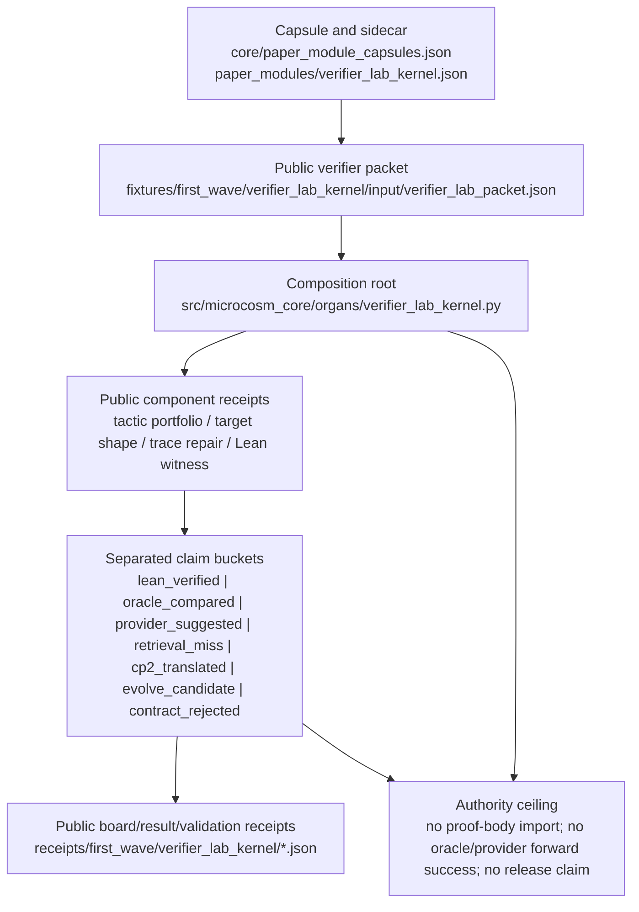

# Verifier Lab Kernel

`verifier_lab_kernel` is the public composition root for the formal-math
verifier lab. It is not a theorem prover, a benchmark runner, a private Lean
import, or a frontend surface. It composes already-public Microcosm organs into
one leak-proof receipt so a reader can see which claim came from a verifier,
which claim came from an oracle comparator, which claim came from a provider
hypothesis, and which rows were rejected by contract.

The organ consumes:

- a public `ForwardProblem` packet with target shape, statement summary,
  public input hash, and allowed premise ids;
- an `OracleSidecar` packet that may compare against hidden or hindsight
  knowledge but never increments forward success;
- verifier attempts and verifier result classes;
- provider/NIM hypotheses as advisory residual diagnoses only;
- CP2 typed action candidates, not proof bodies or raw tactic scripts;
- bounded Evolve candidates over policy artifacts only.

The runnable fixture also calls the existing public components:

- `tactic_portfolio_availability_probe`;
- `target_shape_tactic_routing_gate`;
- `formal_math_verifier_trace_repair_loop`;
- `formal_math_lean_proof_witness`.

## Shape

Read the verifier lab kernel as a public receipt composition route, not as a
proof oracle. The local path spine is the capsule and sidecar
(`core/paper_module_capsules.json::paper_modules[0:paper_module.verifier_lab_kernel]`,
`paper_modules/verifier_lab_kernel.json`), the runtime composition root
(`src/microcosm_core/organs/verifier_lab_kernel.py`), the public packet
(`fixtures/first_wave/verifier_lab_kernel/input/verifier_lab_packet.json`), and
the emitted public receipts under `receipts/first_wave/verifier_lab_kernel/`.



## Prior Art Grounding

This organ is grounded in small-kernel theorem-proving and proof-certificate
composition patterns. The [LCF approach](https://www.research.ed.ac.uk/en/publications/lcf-a-way-of-doing-proofs-with-a-machine/)
and [HOL Light](https://www.cl.cam.ac.uk/~jrh13/papers/hollight.html) anchor the
idea that a verifier lab should distinguish trusted checked results from
heuristics and automation. Lean-oriented work such as
[LeanDojo](https://arxiv.org/abs/2306.15626) adds the modern agent context:
retrieval, provider hypotheses, and proof-state interaction need explicit
boundaries before they can influence proof claims.

Microcosm borrows the composition discipline: verifier success, oracle
comparison, provider hypothesis, CP2 translation, and Evolve candidate rows are
separate buckets with separate authority. It does not count oracle or provider
success as forward proof success.

The acceptance receipt must separate these buckets:

- `lean_verified`;
- `provider_suggested`;
- `oracle_compared`;
- `contract_rejected`;
- `retrieval_miss`;
- `cp2_translated`;
- `evolve_candidate`.

The kernel rejects five contract failures:

- forward problems that carry candidate, ideal, repair, oracle, source proof,
  proof body, or base-index fields;
- oracle comparator success counted as forward success;
- provider hypotheses claiming proof authority;
- CP2 candidates carrying proof bodies, raw tactic scripts, provider bodies, or
  oracle templates;
- Evolve candidates mutating anything outside the bounded policy-artifact set.

## Authority Ceiling

This paper module describes public fixture and exported bundle receipts only.
It does not authorize private proof-body import, Mathlib-dependent proof
authority, oracle-to-forward success, provider proof authority, CP2 proof
bodies, arbitrary Evolve mutation, source mutation, benchmark solve-rate
claims, release, publication, hosted deployment, or secret export.

## Limitations

The verifier lab kernel is a composition and receipt-boundary mechanism. It
does not prove theorem correctness beyond the public component receipts it
consumes or emits, and it does not create Mathlib import authority when the
corpus-readiness gate reports only bounded fixture evidence. A Lean/Lake return
code or compiled declaration count is evidence for the corresponding public
fixture or exported bundle, not a license to generalize to arbitrary formal
math benchmarks.

Oracle sidecars remain hindsight or comparator evidence. They can diagnose a
forward problem but cannot increment `forward_success`; the runtime authority
counters must keep `oracle_forward_success_increment_count` at zero. Provider
or NIM hypotheses remain residual diagnoses until a verifier receipt or other
substrate effect exists, so `provider_results_counted` must also remain zero.

CP2 rows are limited to typed action candidates from the bounded action-class
vocabulary, with disconfirmation tests before rerun promotion. They are not
proof bodies, raw tactic scripts, provider output bodies, or oracle templates.
Evolve rows are limited to the named policy-artifact set and must cite baseline
or rerun receipts; they do not authorize arbitrary source mutation. Public
receipts must keep proof, provider, oracle, stdout/stderr, and private-source
bodies out of exported evidence.

Coverage is finite: the present proof consumer exercises the first-wave fixture
and exported-bundle contracts, the five named negative cases, and the
component-stack receipt shape. New claim classes, new fixture packets, or new
release/publication language need a fresh proof consumer and negative cases
before this module can carry them.

## JSON Capsule Binding

- Source row: `core/paper_module_capsules.json::paper_modules[0:paper_module.verifier_lab_kernel]`
- `source_authority: json_capsule`
- This Markdown is a reader projection. The generated Mermaid projection is
  `available_from_capsule_edges`, and the generated Atlas projection is
  `linked_from_capsule_edges`; both are navigation projections derived from the
  capsule row rather than source authority.
- The proof boundary is the public `ForwardProblem` packet, oracle sidecar,
  verifier attempts, verifier result classes, provider hypotheses as residual
  diagnoses, CP2 typed action candidates, bounded Evolve candidates, composed
  public organ calls, contract failures, and validation receipts.
- The authority ceiling excludes private proof-body import, Mathlib-dependent
  proof authority, oracle-to-forward success, provider proof authority, CP2
  proof bodies, arbitrary Evolve mutation, source mutation, benchmark solve-rate
  claims, publication, hosted deployment, release authority, and secret export.

## Claim Ceiling

This paper module can claim reader wiring for the verifier lab kernel
composition root: verifier and mechanism subjects resolve, the runtime source
locus is named, a diagram view and atlas card are generated for this module. It
cannot claim private proof-body import, Mathlib-dependent proof authority,
oracle-to-forward success, provider proof authority, CP2 proof bodies, arbitrary
Evolve mutation, source mutation, benchmark solve-rate claims, publication
approval, hosted deployment, release approval, secret export, or whole-system
correctness.

Fixture receipts, exported-bundle receipts, focused tests, and public component
composition can support only bucket separation across verifier, oracle,
provider, CP2, and Evolve rows. The diagram view and atlas card are navigation
aids; they do not convert oracle or provider success into forward proof success,
and they do not authorize benchmark or release claims.

## Structured Lattice Bindings

The capsule row yields 23 generated relationship edges:

- Two `explains` edges bind the verifier lab kernel to its public receipt
  composition semantics.
- One `code_locus` edge binds the reader path to the runnable kernel source.
- Six principle edges and four axiom edges place the kernel under its
  proof-boundary, public-receipt, and authority-ceiling doctrine.
- Nine `depends_on` paper-module edges keep the verifier, oracle, provider,
  CP2, Evolve, tactic, target-shape, repair-loop, and proof-witness surfaces
  separate before any reader broadens the claim.
- One resolved concept edge binds the generated row to the governed verifier
  lab concept.

The generated Mermaid projection is `available_from_capsule_edges`, the
generated Atlas projection is `linked_from_capsule_edges`, and
`source_authority` remains `json_capsule`. No selective relation remains
unpopulated in the generated row.

## Governing Lattice Relation

The governing lattice should be read as a claim-separation contract. The concept
edge to `concept.formal_math_and_proof_witness_bundle` says the reader is
looking at a proof-witness bundle, not a single proof oracle. The mechanism edge
to `mechanism.verifier_lab_kernel.composes_public_formal_math_receipts` narrows
that concept to one public operation: compose formal-math component receipts
into a leak-proof aggregate while keeping verifier, oracle, provider, retrieval,
CP2, Evolve, and contract-rejected buckets distinct.

The code-locus edge is the runtime authority boundary. `run` and
`run_kernel_bundle` select fixture or exported-bundle mode, `_build_result`
loads the public packet and negative cases, validates the proof-lab route, runs
or consumes the component stack, scans for forbidden classes, builds
`claim_separation`, and records authority counters. `_write_receipts` then emits
the board, result, validation, and acceptance receipts with
`body_in_receipt: false`, the receipt-transparency contract, and the same
anti-claim. A reader should treat those symbols as the executable edge behind
the Markdown, sidecar, Mermaid, and Atlas projections.

The nine `depends_on` paper-module edges are not a loose bibliography. They are
the proof-lab dependency spine: corpus readiness, Lean Std premise indexing,
premise retrieval, tactic availability, target-shape routing, Ring2 precision
and recall, verifier trace repair, proof diagnostic evidence, and the Lean
proof witness each remain separately bounded before the kernel aggregates their
receipts. This prevents a successful component from lending authority to a
different bucket. The principle refs `P-1`, `P-2`, `P-3`, `P-6`, `P-8`, and
`P-15`, plus axiom refs `AX-1`, `AX-2`, `AX-5`, and `AX-7`, are therefore read
as ceiling law: public receipt evidence may be composed, but hidden bodies,
provider/oracle success, source mutation, release authority, and whole-system
correctness cannot cross the lattice boundary.

Focused test evidence checks the same relation. The verifier-lab test asserts
that all expected negative cases are observed, all component statuses pass,
`claim_separation` contains exactly the seven public buckets, oracle/provider
authority counters stay at zero, `body_in_receipt` is false, public receipt paths
do not leak local roots, and legacy redaction fields do not survive receipt
normalization. Those checks make the lattice relation concrete for this module:
the public aggregate receipt is evidence of separation and containment, not of
unbounded proof authority.

Evidence binding:

- JSON capsule authority: `core/paper_module_capsules.json#paper_module.verifier_lab_kernel`.
- Mechanism source: `core/mechanism_sources.json#mechanism.verifier_lab_kernel.composes_public_formal_math_receipts`.
- Organ atlas edge: `core/organ_atlas.json#verifier_lab_kernel`.
- Runtime source: `src/microcosm_core/organs/verifier_lab_kernel.py`.
- First command: `PYTHONPATH=src python3 -m microcosm_core.organs.verifier_lab_kernel run --input fixtures/first_wave/verifier_lab_kernel/input --out receipts/first_wave/verifier_lab_kernel`.

## Reader Evidence Routing

Cold-reader audit starts with the generated sidecar for this module, not with a
broad theorem-proving claim. The sidecar must confirm that verifier and
mechanism subjects resolve and that a diagram view and atlas card are available
for this module.

Evidence should be read in this order:

- Module definition:
  `core/paper_module_capsules.json::paper_module.verifier_lab_kernel` and
  `paper_modules/verifier_lab_kernel.json`.
- Runtime proof:
  `src/microcosm_core/organs/verifier_lab_kernel.py`, the fixture input packet,
  and the public component calls listed above.
- Bucket-separation proof:
  receipt rows for `lean_verified`, `provider_suggested`, `oracle_compared`,
  `contract_rejected`, `retrieval_miss`, `cp2_translated`, and
  `evolve_candidate`.
- Negative boundary proof:
  rejection of private proof bodies, oracle-to-forward success, provider proof
  authority, CP2 proof bodies, arbitrary Evolve mutation, source mutation,
  benchmark solve-rate claims, release claims, hosted-deployment claims, and
  secret export.

## Receipt Expectations

A complete local receipt should include:

- Public fixture execution for `verifier_lab_kernel`.
- Focused pytest for `tests/test_verifier_lab_kernel.py`.
- Paper-module corpus check and the shared paper-module coverage contract.
- Projection check when the shared builder lane is clean.
- Generated row proof from `paper_modules/verifier_lab_kernel.json`.

The receipt should preserve bucket separation for verifier, oracle, provider,
CP2, and Evolve rows while restating proof-body, provider, benchmark, release,
hosted-deployment, and secret-export exclusions.

## Validation Receipt Path

Validate the reader projection from the repo root without mutating durable
receipt or generated projection surfaces:

```bash
./repo-pytest microcosm-substrate/tests/test_verifier_lab_kernel.py -q --basetemp=/tmp/microcosm_verifier_lab_kernel_pytest
./repo-python microcosm-substrate/scripts/build_doctrine_projection.py --check-paper-module-corpus
```

## Re-Entry Conditions

Re-enter through this paper module when:

- `verifier_lab_kernel.py` changes bucket assignment, component composition, or
  contract-rejection semantics.
- A fixture or exported receipt stops preserving separation between verifier,
  oracle, provider, CP2, Evolve, retrieval-miss, and contract-rejected rows.
- The generated sidecar no longer reports 23 relationship edges, zero
  unpopulated selective relations, Mermaid `available_from_capsule_edges`,
  Atlas `linked_from_capsule_edges`, or `source_authority: json_capsule`.
- A claim tries to promote oracle comparison, provider hypothesis, CP2 action,
  or Evolve candidate evidence into forward proof authority, benchmark
  solve-rate authority, hosted-deployment authority, release authority, or
  secret-export authority.
