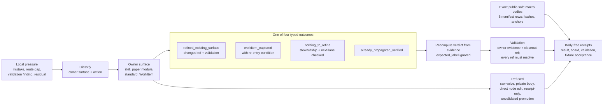

# Voice-To-Doctrine Self-Improvement Loop

This module is the public Microcosm projection of the macro system's recursive
self-improvement metabolism. It is not a synthetic receipt layer. It imports
the real macro shape from `recursive_self_improvement_operating_loop`,
`doctrine_population_loop`, and `local_to_general_propagation`: local pressure
is sensed, classified, assigned to an owner surface, mutated or captured there,
validated, closed out, and given a concrete re-entry condition.

The exported runtime bundle also carries exact public-safe copies of the
non-secret macro bodies that make this loop real: recursive self-improvement,
doctrine population, local-to-general propagation, the plane-home decision
table, Task Ledger metacontrol, Task Ledger skill doctrine, and the Task Ledger
standard. Receipts report only source refs, hashes, counts, and scan status; the
body text lives under `examples/.../source_modules/ai_workflow/`.

## Purpose

The organ answers one question: did a declared lesson actually change a named
owner surface and pass that surface's own validation, or did it only produce a
receipt that says so? "The system learned from its work" is an easy claim to
assert and a hard one to back. Without a check, a log entry, a closed ticket, or
a confident summary all read as progress. This validator refuses that shortcut.

Each lesson row must name the surface it changed (a skill, a paper module, a
standard, or a captured WorkItem), the action it took there, and the validation
and closeout refs that show the change held. Every ref must resolve to a real
file in the exported bundle, the copied source modules, or the public Microcosm
tree. A lesson then lands in exactly one of four outcomes:
`refined_existing_surface` (a surface changed and was validated),
`workitem_captured` (deferred work, but only with a concrete re-entry
condition), `nothing_to_refine` (a typed null result that still required
stewardship and a next-best-lane check), or `already_propagated_verified`.
Anything that does not fit one of these is a finding, not an outcome.

The unusual part is the defence against self-grading. A lesson row may carry an
`expected_label` or `expected_status` field, but the validator ignores it and
recomputes the verdict from the evidence. If the row is not genuinely backed,
its own asserted label cannot rescue it, and the case is recorded as
`VOICE_DOCTRINE_BAKED_EXPECTED_LABEL_IGNORED`. A fixture cannot pass by
declaring its own success. The same instinct runs through the negative floor:
raw operator voice, private thread bodies, provider payloads, direct edits to
doctrine nodes, and global promotion without owner validation are each rejected,
keeping "the system improves itself" separate from "this public artifact may
rewrite doctrine or export private voice."

## Shape



## Public Mechanics

- Local lessons carry macro pattern refs, evidence refs, owner-surface ids,
  owner actions, validation refs, closeout refs, and public-safe outcomes.
- Owner surfaces are explicit: skills, paper modules, standards, and residual
  captures each retain their own mutation authority.
- `refined_existing_surface` requires a changed owner surface and validation.
- `workitem_captured` requires a concrete re-entry condition.
- `nothing_to_refine` requires stewardship and next-best-lane checks.
- Raw operator voice, private thread bodies, provider payloads, live Task
  Ledger bodies, direct doctrine-node edits, and global promotion claims are
  rejected by negative cases.
- Exported bundle validation requires `source_module_manifest.json`, verifies
  each copied body hash/line/byte/anchor contract, and scans copied bodies for
  forbidden public material.

## Reader Evidence Routing

Read this module as a public-safe lesson-propagation validator, not as a
general doctrine mutation license. The fixture proves that local pressure must
choose a named owner surface, perform an owner-authorized action, carry
validation and closeout refs, and either refine an existing surface, capture a
WorkItem with a re-entry condition, record a typed `nothing_to_refine`, or
verify an already-propagated result.

Read source-open evidence through the exported bundle manifest. It carries
eight copied non-secret macro bodies: three paper modules, four skills or skill
companions, and the Task Ledger standard. Each manifest row records byte and
line counts, exact source and target hashes, required anchors, and
`body_in_receipt: false`. The source bodies make the macro loop inspectable,
while receipts remain refs, hashes, counts, scan status, and authority ceilings.

Read the negative floor as equally load-bearing. Raw operator voice bodies,
private thread bodies, provider payload bodies, direct doctrine-node edits,
receipt-only progress, live Task Ledger mutation, and unvalidated global
promotion are rejected. Those rejections keep "the system learns from work"
separate from "this public artifact can mutate doctrine or export private
state."

## Reader Proof Boundary

The proof boundary for this module is the JSON capsule row, the
voice-to-doctrine organ, fixture and bundle manifests, copied macro body
manifest, owner-surface policy checks, focused tests, and body-free validation
receipts. The current generated-row projection reports 16 relationship edges,
Mermaid `available_from_capsule_edges`, Atlas `linked_from_capsule_edges`, and
zero unresolved selective relations. That generated readback helps navigation;
the capsule, source files, and receipts remain authority.

The positive claim is that public lesson propagation can require owner
surfaces, validation refs, closeout refs, re-entry conditions, and negative
case refusals. It does not authorize raw voice export, live Task Ledger
mutation, direct doctrine-node edits, global doctrine promotion, source
mutation, release, or whole-system authority.

## Public Site Availability Boundary

The public site may show the lesson-propagation loop, allowed outcomes,
owner-surface refs, negative floor, source-manifest status, and receipt refs.
It must not present the loop as a public doctrine mutation console, a live Task
Ledger editor, an autonomous promotion engine, or proof that all future lessons
will be generalized correctly. Any site summary should keep the re-entry
condition beside captured-work outcomes.

## Public-Safe Body Handling

The exported runtime bundle is the public-safe body floor. Receipts may carry
source refs, hashes, counts, anchors, scan status, outcome classes, and
authority ceilings. They must not inline raw seed, raw operator voice, private
thread bodies, provider payloads, live Task Ledger rows, account/session
material, credentials, or private macro bodies outside the manifest-governed
copy lane.

## Prior Art Grounding

This organ is grounded in after-action review, lessons-learned, and pattern
language practices. NASA's Lessons Learned Information System is a public
example of preserving operational lessons so future work can reuse them, while
pattern-language practice gives a vocabulary for turning repeated local
solutions into named, reusable forms. Microcosm adopts that direction without
collapsing operator voice into doctrine: a local lesson only becomes durable
when it has evidence, an owner surface, a validation receipt, and a bounded
re-entry path.

Prior-art anchors:

- NASA Lessons Learned Information System:
  https://llis.nasa.gov/
- Pattern language background:
  https://hillside.net/patterns/

## Runtime

```bash
PYTHONPATH=src python -m microcosm_core.organs.voice_to_doctrine_self_improvement_loop run \
  --input fixtures/first_wave/voice_to_doctrine_self_improvement_loop/input \
  --out receipts/first_wave/voice_to_doctrine_self_improvement_loop
```

The exported runtime bundle uses the same validator without negative-case
inputs:

```bash
PYTHONPATH=src python -m microcosm_core.organs.voice_to_doctrine_self_improvement_loop run-bundle \
  --input examples/voice_to_doctrine_self_improvement_loop/exported_voice_to_doctrine_bundle \
  --out receipts/runtime_shell/demo_project/organs/voice_to_doctrine_self_improvement_loop
```

## Validation Receipt Path

Run from `microcosm-substrate`:

```bash
PYTHONPATH=src ../repo-python -m microcosm_core.organs.voice_to_doctrine_self_improvement_loop run \
  --input fixtures/first_wave/voice_to_doctrine_self_improvement_loop/input \
  --out /tmp/microcosm-voice-to-doctrine-self-improvement-loop/fixture \
  --acceptance-out /tmp/microcosm-voice-to-doctrine-self-improvement-loop/acceptance.json \
  --card
PYTHONPATH=src ../repo-python -m microcosm_core.organs.voice_to_doctrine_self_improvement_loop run-bundle \
  --input examples/voice_to_doctrine_self_improvement_loop/exported_voice_to_doctrine_bundle \
  --out /tmp/microcosm-voice-to-doctrine-self-improvement-loop/bundle \
  --card
PYTHONPATH=src ../repo-python -m pytest -p no:cacheprovider tests/test_voice_to_doctrine_self_improvement_loop.py -q
PYTHONPATH=src ../repo-python scripts/build_doctrine_projection.py --check-paper-module-corpus
```

A green fixture or bundle receipt proves only the public lesson-propagation boundary
above; it does not grant source mutation, live Task Ledger mutation, global
doctrine-promotion, release, or whole-system authority.

## Anti-Claim

This module does not export raw seed, raw operator voice, private thread
bodies, provider payloads, account/session state, live Task Ledger rows, proof
authority, source mutation authority, publication authority, or private-root
equivalence. It shows the public mechanics of substrate learning under
owner-surface evidence gates.

## JSON Capsule Binding

The source authority for this paper module is the JSON capsule row
`paper_module.voice_to_doctrine_self_improvement_loop` in
`core/paper_module_capsules.json::paper_modules[57:paper_module.voice_to_doctrine_self_improvement_loop]`.
This Markdown page is a reader projection over that row. The generated JSON
instance at `paper_modules/voice_to_doctrine_self_improvement_loop.json` is
builder output from the capsule and source manifests, not an independent source
of truth.

Read the capsule binding as a pointer to the admitted subject, mechanism,
runtime code locus, standard, fixture manifest, focused tests, and receipt
paths named below. It does not make this page a doctrine mutation surface, a
raw-voice export channel, a live Task Ledger editor, or a release approval.

## JSON Capsule Boundary

Future expansion must re-enter through the capsule owner lane: update the real
row in `core/paper_module_capsules.json`, refresh the generated paper-module
corpus with its builder, and validate the focused voice-to-doctrine fixture plus
the shared paper-module coverage contract. Hand edits to generated JSON rows,
aggregate lattice projections, public-site HTML, search indexes, or receipt
payloads do not expand this module's authority.

The exported bundle makes selected non-secret macro bodies inspectable through
manifest hashes, anchors, line counts, and body-free receipts. That proof
boundary supports public lesson-propagation evidence only; it does not grant
source mutation, live ledger mutation, automatic doctrine promotion, provider
dispatch, private-root equivalence, publication approval, or whole-system
correctness.

## Structured Lattice Bindings

- Capsule row: `paper_module.voice_to_doctrine_self_improvement_loop` in
  `core/paper_module_capsules.json::paper_modules[57:paper_module.voice_to_doctrine_self_improvement_loop]`.
- Generated JSON instance: `paper_modules/voice_to_doctrine_self_improvement_loop.json`.
- `source_authority: json_capsule`
- Subject edge: `paper_module.voice_to_doctrine_self_improvement_loop`
  explains organ `voice_to_doctrine_self_improvement_loop` and mechanism
  `mechanism.voice_to_doctrine_self_improvement_loop.validates_public_voice_to_doctrine_self_improvement_loop`.
- Runtime code locus:
  `src/microcosm_core/organs/voice_to_doctrine_self_improvement_loop.py` with
  `run`, `run_voice_to_doctrine_bundle`, `validate_projection_protocol`,
  `validate_policy`, `validate_owner_surfaces`, `validate_lessons`,
  `validate_negative_cases`, `_build_board`, `result_card`,
  `EXPECTED_NEGATIVE_CASES`, and `AUTHORITY_CEILING`.
- Standard: `standards/std_microcosm_voice_to_doctrine_self_improvement_loop.json`.
- Fixture manifest:
  `core/fixture_manifests/voice_to_doctrine_self_improvement_loop.fixture_manifest.json`.
- Focused tests: `tests/test_voice_to_doctrine_self_improvement_loop.py`.
- This Markdown is a reader projection; the JSON capsule is source authority
  for subjects, code loci, doctrine refs, and generated projection state.
- The generated Mermaid projection is `available_from_capsule_edges`; the
  generated Atlas projection is `linked_from_capsule_edges`.
- The proof boundary is the local lesson-propagation fixture, exported bundle
  receipt, copied source-module manifest, owner-surface checks, and negative
  cases named above, not source mutation, live Task Ledger mutation, raw
  operator voice export, release, or whole-system authority.
- authority ceiling: Declared public-safe lesson-propagation fixture only; no
  raw operator voice export, private body export, provider payload export,
  source or doctrine mutation authority, global-promotion authority, live Task
  Ledger mutation, publication approval, release approval, provider calls,
  private-root equivalence, or whole-system correctness.

## Claim Ceiling

This paper module can claim a public-safe lesson-propagation fixture. It can
explain owner-surface checks, negative cases, copied source-module manifests,
and body-free receipts. A diagram view and atlas card are generated for this
module.

It cannot claim raw operator voice export, private body export, provider payload
export, source mutation, doctrine mutation authority, global-promotion
authority, live Task Ledger mutation, publication approval, release approval,
provider calls, private-root equivalence, or whole-system correctness.

## Receipt Expectations

- `voice_to_doctrine_self_improvement_loop_result.json` records the public
  lesson-propagation result and stays body-free.
- `voice_to_doctrine_self_improvement_loop_board.json` gives a reader board for
  owner surfaces, lesson rows, outcomes, validation refs, closeout refs, and
  source pattern refs.
- `voice_to_doctrine_self_improvement_loop_validation_receipt.json` records
  `status: pass`, zero issues, `body_in_receipt: false`, and an authority
  ceiling that denies raw-voice export, private thread export, provider calls,
  live Task Ledger mutation, direct doctrine-node hand edits, global doctrine
  promotion, release, and source mutation.
- `voice_to_doctrine_self_improvement_loop_fixture_acceptance.json` is the
  fixture acceptance receipt and carries the same public-safe authority
  boundary.
- The exported runtime bundle validation receipt is source-manifest and bundle
  shape evidence only; it must not inline copied macro body text or turn local
  lesson propagation into public source-mutation authority.
