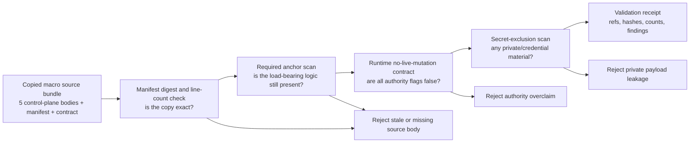

# Work Landing Control Spine

## Teleology

`work_landing_control_spine` makes the macro work-landing control plane
inspectable inside Microcosm by copying the non-secret command, reconcile,
mission preflight, and private-index scoped commit source bodies into a public
bundle. The point is not to let the public validator mutate Git or ledgers; it
is to expose the real control-plane mechanics that govern claims, owned paths,
same-path conflicts, expected-parent checks, shared-index quarantine, finalizer
ordering, and scoped commit discipline.

## Purpose

The macro repository this slice comes from is edited by several agents at once,
so its hardest engineering problem is mundane: how does one agent land a small,
finished commit without colliding with another agent's half-done work in the
same files, and without claiming more than it actually did? The control plane
that answers this lives in a handful of source modules. This module copies those
bodies, non-secret, into a public bundle so a reader can inspect the real
mechanics rather than take a description on trust.

The single question it answers is narrow: are these copied control-plane bodies
the genuine ones, with their load-bearing logic still present, and does the
bundle keep within its stated limits? It is a witness over copied source, not a
runner. It never touches Git, ledgers, or claims.

Two ideas in the copied source are worth a reader's attention. The first is the
scoped commit. `scoped_commit.py` builds a throwaway Git index from the current
`HEAD`, stages only the exact paths or hunks the agent declares it owns, writes a
tree from that private index, and commits it against the captured parent with a
compare-and-swap on the branch ref. The shared `.git/index` is never written.
What was a three-step behavioural rule (add exact paths, check nothing else is
staged, then commit) becomes an infrastructure invariant: an agent physically
cannot sweep up a neighbour's dirty changes, because those changes were never in
the index it committed from. The second is ordering. `work_landing_status.py`
fixes a sequence of controller actions and a set of prerequisites, so that
claims are only released after the Work Ledger session is finalised, and
convergence is only recomputed after claims are released. The module checks that
these anchors are still present in the copied bodies, which is what separates an
honest copy from a stale hash bag.

## Shape



The shape is a public validation spine for copied work-landing control-plane
source. It validates exact copied module bodies, required anchors, contract
flags, and secret-exclusion posture, then writes a receipt that contains
metadata, hashes, counts, gates, and findings. It does not execute live Git
mutation, mutate Task Ledger or Work Ledger, release claims, stage broadly, or
run private-index commits.

## Technical Mechanism

The validator in `src/microcosm_core/macro_tools/work_landing_control_spine.py`
is a staged copied-source witness, not a live work-landing actuator. It loads
`bundle_manifest.json`, `source_module_manifest.json`, and
`work_landing_control_runtime_contract.json`; then it checks seven required
inputs: five copied macro source bodies plus the two manifest/contract JSON
files. The source body rows must exist under `source_modules/`, keep the
expected SHA-256 digests and line counts from the bundle manifest, stay inside
the allowed material classes, and classify source modules as
`copied_non_secret_macro_body`.

After file parity, the validator scans required anchors for each copied macro
body: `work_landing.py` must still expose the parser and admission/begin/status
anchors; `work_landing_status.py` must still expose controller action and
reconcile/finalizer models; the mission-transaction preflight wrapper and
kernel must still expose owned-path, session-id, shared-index quarantine, and
private-index admission anchors; and `scoped_commit.py` must still carry the
private-index scoped-commit and shared-index non-mutation anchors. These anchor
checks make the copied bundle more than a hash bag: the receipt shows that the
specific control-plane mechanisms readers care about are still present.

The final gates are authority and payload boundaries. The runtime contract must
keep every live-mutation flag false, including live Git mutation, Task Ledger
mutation, Work Ledger mutation, claim release, shared-index mutation,
private-index commit execution, broad staging, provider calls, publication, and
release authority. The secret-exclusion scan runs over the copied source bodies
and manifest/contract inputs, while the output receipt records refs, hashes,
counts, anchor rows, authority rows, and findings with `body_in_receipt: false`.
Focused tests pin the pass case, the live-mutation overclaim blocker, streaming
line-count behavior, source-manifest exact-copy checks, and the CLI smoke path.

## Public Contract

The public command is:

```bash
PYTHONPATH=src ../repo-python -m microcosm_core.cli work-landing-control-spine \
  validate-control-bundle \
  --input examples/work_landing_control_spine/exported_work_landing_control_bundle \
  --out receipts/first_wave/work_landing_control_spine
```

The validator checks copied module digests, line counts, required source
anchors, the no-live-mutation runtime contract, the originating overclaim
WorkItem reference, and a secret-exclusion scan over the copied bundle. Source
bodies live in the bundle; receipts carry refs, hashes, counts, gates, and
findings.

## Governing Standard

`standards/std_microcosm_work_landing_control_spine.json` owns the receipt
contract, source refs, allowed public inputs, forbidden private inputs, and
authority ceiling for this import.

## Source Substrate

The copied macro bodies are:

- `tools/meta/control/work_landing.py`
- `system/lib/work_landing_status.py`
- `tools/meta/control/mission_transaction_preflight.py`
- `system/lib/mission_transaction_landing_preflight.py`
- `tools/meta/control/scoped_commit.py`

This closes the old `work_landing_tool_body_import` overclaim by adding an
exact copied-source bundle beneath the existing public dry-run refactor.

## Source-Open Body Floor

The source-open floor for this module is the copied bundle plus the validator
that checks it:

- validator runtime: `src/microcosm_core/macro_tools/work_landing_control_spine.py`
- standard: `standards/std_microcosm_work_landing_control_spine.json`
- copied source bundle:
  `examples/work_landing_control_spine/exported_work_landing_control_bundle`
- copied source manifest:
  `examples/work_landing_control_spine/exported_work_landing_control_bundle/source_module_manifest.json`
- runtime contract:
  `examples/work_landing_control_spine/exported_work_landing_control_bundle/work_landing_control_runtime_contract.json`
- focused tests: `tests/test_work_landing_control_spine.py`
- generated placeholder JSON row:
  `paper_modules/work_landing_control_spine.json`

That floor lets a reader inspect the public control-plane mechanics and replay
the digest, anchor, no-live-mutation, and secret-exclusion checks. It is not a
license to run live Git commands, mutate ledgers, claim release authority, or
treat copied source bodies as a private-root-equivalent control plane.

## Claim Ceiling

This spine validates copied non-secret control-plane source bodies for public
inspection. It does not authorize live Git mutation, shared-index mutation,
Task Ledger or Work Ledger mutation, claim release, broad staging, private-index
commit execution, provider calls, credential export, publication, hosting, or
release readiness.

## Structured Lattice Bindings

- generated JSON row:
  `paper_modules/work_landing_control_spine.json`.
- current source authority:
  `paper_module_payload.source_authority: json_capsule`.
- capsule source row:
  `core/paper_module_capsules.json::paper_modules[17:paper_module.work_landing_control_spine]`.
- Markdown projection:
  `paper_modules/work_landing_control_spine.md`.
- validator runtime:
  `src/microcosm_core/macro_tools/work_landing_control_spine.py`.
- standard:
  `standards/std_microcosm_work_landing_control_spine.json`.
- copied source bundle:
  `examples/work_landing_control_spine/exported_work_landing_control_bundle`.
- focused tests:
  `tests/test_work_landing_control_spine.py`.
- coverage contract locus:
  `tests/test_microcosm_paper_module_coverage_contract.py`.

These bindings are reader evidence over a real JSON capsule row. The copied
bundle and validator make the work-landing mechanics auditable while the
capsule row, not this Markdown, stays source authority for subjects, code loci,
doctrine refs, and generated projection state.

## Governing Doctrine Relations

The generated sidecar reports sixteen capsule-derived edges for this page and
zero unresolved selective relations. Its subjects bind the paper module to
`macro_projection_import_protocol` and
`mechanism.macro_projection_import_protocol.validates_public_macro_projection_imports`;
its code-locus edges bind the reader page to
`src/microcosm_core/macro_tools/work_landing_control_spine.py` and
`src/microcosm_core/organs/macro_projection_import_protocol.py`. The mechanism
claim is therefore narrow: Microcosm validates a public macro-projection import
bundle by copied-source parity, required anchors, no-live-mutation flags, and
secret-exclusion evidence.

The concept edges are
`concept.work_landing_and_continuity_control_bundle` and
`concept.import_projection_and_drift_control_bundle`. The governing principles
are `P-5`, `P-10`, `P-14`, `P-15`, and `P-16`; the governing axioms are `AX-4`
and `AX-9`; and the declared paper-module dependencies are
`paper_module.macro_projection_import_protocol`,
`paper_module.durable_agent_work_landing_replay`, and
`paper_module.mission_transaction_work_spine`. Together these relations explain
why the validator treats source-copy fidelity, transaction preflight,
private-index containment, and no-release/no-live-mutation ceilings as one
control mechanism rather than as separate prose claims.

## Reader Evidence Routing

Read a passing control-bundle receipt as "the copied source bodies matched the
manifest, required anchors were present, the no-live-mutation authority ceiling
held, and no forbidden private material was found." Do not read it as a live
landing operation or a proof that future work sessions are safe.

Read digest and line-count failures as stale-copy evidence only. They show the
public bundle no longer matches the source manifest; they do not authorize an
agent to repair macro source or regenerate shared capsule surfaces without a
separate claim.

Read authority-overclaim failures as release-boundary evidence. A contract that
claims live Git, ledger mutation, claim release, broad staging, private-index
commit execution, provider calls, or release authority must stay blocked.

## Public Site Availability Boundary

This module is public-safe to expose as a reader route because it describes the
copied work-landing control-plane source bundle, validator contract, standards,
tests, receipt paths, no-live-mutation gates, and authority ceilings without
granting live mutation authority. Website availability should come from the
existing Microcosm site builder reading this source page and generated
Microcosm data; generated site HTML, object maps, search indexes, and content
graphs are projections, not source authority.

## Public-Safe Body Handling

This page may name copied control-plane source paths, validator paths, standards,
focused tests, source-manifest refs, runtime-contract refs, receipt paths,
required anchors, digests, line counts, and no-live-mutation gate fields. It
must not embed live Git state, Task Ledger or Work Ledger payload bodies,
private-index internals, provider payloads, credentials, account/session state,
raw operator voice, private source bodies outside the public-safe copied bundle,
or any payload that would imply claim release or live mutation authority.

Copied public-safe control-plane bodies stay in the exported bundle source-module
area. Reader cards, receipts, generated site projections, and this Markdown
should represent them by refs, hashes, line counts, anchors, booleans,
summaries, and explicit no-live-mutation ceilings rather than by duplicating
private or live control-plane payloads.

## Reader Proof Boundary

Read this page as a public reader projection over a JSON-capsule-backed
Microcosm paper-module row. The generated JSON row reports
`paper_module_payload.source_authority: json_capsule`, and the capsule source
row is
`core/paper_module_capsules.json::paper_modules[17:paper_module.work_landing_control_spine]`.
The useful proof boundary is still narrow: copied source-manifest parity,
required-anchor checks, no-live-mutation gates, source locus, and validation
receipts. It does not grant live Git authority, Task Ledger or Work Ledger
mutation authority, private-index commit authority, release authority, or
whole-lattice correctness.

## JSON Capsule Binding

`core/paper_module_capsules.json` now contains
`paper_module.work_landing_control_spine` at
`core/paper_module_capsules.json::paper_modules[17:paper_module.work_landing_control_spine]`.
This Markdown is a reader projection; `source_authority: json_capsule` lives in
that capsule row. The generated Mermaid projection is available from capsule
edges, and the generated Atlas projection is available or blocked only according
to the generated capsule status, not this prose page.

Treat `src/microcosm_core/macro_tools/work_landing_control_spine.py`, the copied
source bundle, and the focused fixture receipts as the public proof boundary.
They support the capsule row without authorizing live work-landing mutation.

## JSON Capsule Boundary

This paper module is JSON-capsule-backed in the generated paper-module corpus:
`paper_module_payload.source_authority` is `json_capsule`. The copied
work-landing control-plane source bodies make scoped landing mechanics
inspectable to readers, but they do not expand the authority ceiling beyond the
capsule row.

Re-entry is exact for any future expansion: after a new accepted organ or
mechanism subject is admitted and any named code loci resolve, update the real
row in `core/paper_module_capsules.json` and regenerate with
`scripts/build_doctrine_projection.py --write-paper-module-corpus`. Until that
happens, this Markdown explains the proof boundary; it does not source live Git
mutation, Task Ledger or Work Ledger mutation authority, private-index commits,
release claims, or aggregate doctrine-lattice coverage.

## Capsule Re-entry Packet

- current source authority: generated JSON reports
  `paper_module_payload.source_authority: json_capsule`.
- capsule source row:
  `core/paper_module_capsules.json::paper_modules[17:paper_module.work_landing_control_spine]`.
- current generated projection status: read the generated JSON row and coverage
  export; this Markdown is not projection authority.
- resolved code locus:
  `src/microcosm_core/macro_tools/work_landing_control_spine.py`.
- re-entry condition: after an additional organ or mechanism admission lands,
  update `paper_module.work_landing_control_spine` in
  `core/paper_module_capsules.json`, run
  `scripts/build_doctrine_projection.py --write-paper-module-corpus`, and verify
  Mermaid and Atlas statuses through generated outputs.
- authority ceiling: this Markdown provides reader evidence only; it does not
  source live Git mutation, Task Ledger or Work Ledger mutation authority,
  private-index commits, release claims, or aggregate doctrine-lattice coverage.

## Receipt Expectations

A valid future capsule admission or refresh should provide:

- one passing copied-source bundle receipt,
- source-manifest digest and line-count match evidence for every required macro
  source body,
- required-anchor evidence for the command, preflight, status/reconcile, and
  scoped-commit loci,
- no-live-mutation contract evidence with every false authority flag still
  false,
- secret-exclusion evidence with `body_in_receipt` false, and
- paper-module corpus readback showing this module's generated Mermaid status
  remains `available_from_capsule_edges` and its generated Atlas status remains
  `linked_from_capsule_edges`, or changes only through a regenerated
  capsule-backed projection.

## Named Proof Consumers

- Bundle validator consumer:
  `PYTHONPATH=src ../repo-python -m microcosm_core.cli work-landing-control-spine validate-control-bundle --input examples/work_landing_control_spine/exported_work_landing_control_bundle --out /tmp/microcosm-work-landing-control-spine/receipt`
  consumes the copied source bodies, bundle manifest, source-module manifest,
  runtime contract, anchor scan, authority-ceiling flags, secret-exclusion scan,
  and body-free receipt writer.
- Focused regression consumer:
  `PYTHONPATH=src ../repo-python -m pytest -p no:cacheprovider tests/test_work_landing_control_spine.py -q`
  pins the green bundle path, exact-copy source-manifest relation, digest and
  line-count checks, live-mutation overclaim rejection, receipt body omission,
  streaming line-count behavior, and CLI argument order.
- Corpus consumer:
  `PYTHONPATH=src ../repo-python scripts/build_doctrine_projection.py --check-paper-module-corpus`
  verifies that this Markdown remains consistent with the JSON sidecar and
  capsule-backed corpus. It is a read-only consistency receipt; it is not
  permission to hand-edit generated projections or shared capsule rows.

## Validation Receipt Path

Reader-verifiable bundle command, run from `microcosm-substrate/`:

```bash
PYTHONPATH=src ../repo-python -m microcosm_core.cli work-landing-control-spine \
  validate-control-bundle \
  --input examples/work_landing_control_spine/exported_work_landing_control_bundle \
  --out receipts/first_wave/work_landing_control_spine
```

The command writes the copied-source validation receipt under
`receipts/first_wave/work_landing_control_spine/`, including
`exported_work_landing_control_bundle_validation_result.json`. That receipt is
the public replay boundary for module digests, required source anchors,
secret-exclusion posture, and the no-live-mutation runtime contract.

This receipt path is reader-verifiable evidence only. It does not flip
Mermaid/Atlas status, create capsule authority, run live Git mutation, mutate
Task Ledger or Work Ledger state, execute private-index commits, release
claims, or aggregate doctrine-lattice coverage.

## Prior Art Grounding

The landing spine is grounded in version-control staging, deterministic workflow
history, and provenance-control patterns. Git's index separates selected changes
from the rest of a dirty worktree, which is the practical ancestor of scoped
path ownership. Temporal workflows show the value of recorded event history and
deterministic replay for long-running work. Microcosm imports those ideas as a
public control spine: preflight, scoped selection, reconcile/finalize checks,
and copied source-body digests make work landing auditable without broad
staging, private-index leakage, or live mutation from the paper module itself.

Prior-art anchors:

- Git staging/index workflow:
  https://git-scm.com/book/en/v2/Git-Basics-Recording-Changes-to-the-Repository
- Temporal workflow event history and replay:
  https://docs.temporal.io/workflows

## Anti-Claim

This spine is local control-plane substrate for inspection and validation. It
does not run live Git mutations; mutate Task Ledger or Work Ledger state;
release claims; stage broadly; execute private-index commits; call providers;
export credentials, account/session state, provider payload bodies, or
recipient-send state; publish; host; or authorize release.
