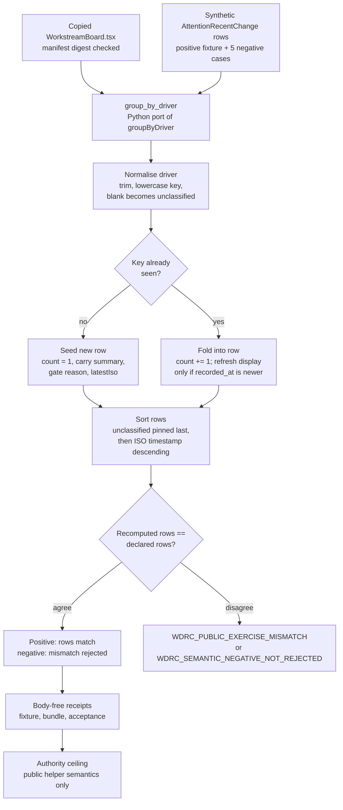

# Workstream Driver Recency Coalescer

## TLDR

`workstream_driver_recency_coalescer` is a Microcosm public semantic-validator organ for the `groupByDriver` helper in `system/server/ui/src/components/cockpit/WorkstreamBoard.tsx`. It imports the real frontend source body as an exact copied non-secret source module and exercises a Python port over synthetic `AttentionRecentChange` rows.

## Purpose

The cockpit's workstream panel is an honest placeholder. The world-model feed
does not yet carry workstream tags, so rather than invent a classifier the
panel groups the recent-changes feed by `active_driver` and labels itself
"grouped by driver". Entries with no driver fall into an `unclassified` bucket.
The richer classifier, which would sort sessions into named workstreams against
the family charter and path heuristics, is deferred to a later pass. The point
of this organ is to check that the grouping the operator actually sees is the
grouping the code computes.

The single question it answers: given a list of recent changes, does the helper
fold them into the rows the fixture declares, in the declared order? The organ
holds a Python port of `groupByDriver` next to the copied frontend source and
recomputes the rows from synthetic input. Where a declared row disagrees with
the recomputed one, the case is rejected.

What is worth noting is how little the helper claims and how carefully it
coalesces. Each driver collapses into one row that carries only the newest
event's summary and gate reason, so a busy driver reads as a single live line
rather than a scroll of duplicates. The `unclassified` bucket is pinned to the
bottom even when it holds the most recent event, so missing attribution never
displaces a named driver from the top of the board. Those two choices, recency
coalescing and the unclassified sentinel, are exactly what the organ pins down,
without claiming the board reflects live cockpit state or that the grouping is
the final workstream model.

## Macro Source

- Source: `system/server/ui/src/components/cockpit/WorkstreamBoard.tsx`
- Imported target: `examples/workstream_driver_recency_coalescer/exported_workstream_driver_recency_coalescer_bundle/source_modules/system/server/ui/src/components/cockpit/WorkstreamBoard.tsx`
- Source module manifest: `examples/workstream_driver_recency_coalescer/exported_workstream_driver_recency_coalescer_bundle/source_module_manifest.json`
- Digest: `b248325a157e3f7eb7320e430c73b130aa44420f73bfbec334730d5aef595ea7`

## JSON Capsule Binding

- Source row: `core/paper_module_capsules.json::paper_modules[51:paper_module.workstream_driver_recency_coalescer]`
- `source_authority: json_capsule`
- This Markdown is a reader projection. The generated Mermaid projection is
  `available_from_capsule_edges`, and the generated Atlas projection is
  `linked_from_capsule_edges`; both are navigation projections derived from the
  capsule's organ, principle, axiom, dependency, and code-locus edges.
- The proof boundary is the copied non-secret `WorkstreamBoard.tsx` helper,
  synthetic `AttentionRecentChange` rows, Python semantic port, bundle manifest,
  digest checks, and validation receipts.
- The authority ceiling excludes live cockpit state, browser/HUD state,
  provider payloads, operator transcripts, account/session state, source
  mutation, frontend release, dispatch authority, and whole-system correctness.

## Structured Lattice Bindings

The capsule row yields 15 generated relationship edges:

- Two `explains` edges bind the organ to its public helper semantics.
- One `code_locus` edge binds the reader path to
  `system/server/ui/src/components/cockpit/WorkstreamBoard.tsx`.
- Four principle edges and four axiom edges place the validator under the
  Microcosm public-proof and authority-ceiling doctrine it depends on.
- Three `depends_on` paper-module edges and one governed concept edge connect
  this capsule to the reader surfaces that should be opened before broadening
  the claim.

The generated Mermaid projection is `available_from_capsule_edges`, the
generated Atlas projection is `linked_from_capsule_edges`, and
`source_authority` remains `json_capsule`.

## Shape



Evidence/accounting:

- Capsule authority:
  `core/paper_module_capsules.json::paper_modules[51:paper_module.workstream_driver_recency_coalescer]`
  binds the organ, mechanism
  `mechanism.workstream_driver_recency_coalescer.validates_public_workstream_driver_recency_coalescer`,
  and runtime code locus
  `src/microcosm_core/organs/workstream_driver_recency_coalescer.py`.
- Generated instance:
  `paper_modules/workstream_driver_recency_coalescer.json` reports
  `paper_module_payload.source_authority: json_capsule`, Mermaid
  `available_from_capsule_edges`, Atlas `linked_from_capsule_edges`, 15
  relationship edges, and no unpopulated selective relations.
- Source-copy floor:
  `examples/workstream_driver_recency_coalescer/exported_workstream_driver_recency_coalescer_bundle/source_module_manifest.json`
  and copied
  `examples/workstream_driver_recency_coalescer/exported_workstream_driver_recency_coalescer_bundle/source_modules/system/server/ui/src/components/cockpit/WorkstreamBoard.tsx`
  provide the non-secret source helper and digest evidence named by this
  module.
- Runtime and tests:
  `src/microcosm_core/organs/workstream_driver_recency_coalescer.py` exposes
  `run`, `run_workstream_bundle`, `evaluate`, `group_by_driver`,
  `result_card`, `EXPECTED_NEGATIVE_CASES`, and `AUTHORITY_CEILING`.
  `tests/test_workstream_driver_recency_coalescer.py` checks the grouping key,
  recency refresh, timestamp sort, unclassified-last behavior, bundle digest
  validation, negative cases, and body-free receipts.
- Receipts and boundary:
  `receipts/first_wave/workstream_driver_recency_coalescer/workstream_driver_recency_coalescer_result.json`,
  `receipts/acceptance/first_wave/workstream_driver_recency_coalescer_fixture_acceptance.json`,
  and
  `receipts/runtime_shell/demo_project/organs/workstream_driver_recency_coalescer/exported_workstream_driver_recency_coalescer_bundle_validation_result.json`
  support only public helper semantics over synthetic rows and copied
  non-secret source. They do not read live cockpit state, browser/HUD state,
  provider payloads, account/session state, source UI state, or release state.

## Claim Ceiling

This module can claim that a copied non-secret `WorkstreamBoard.tsx` helper,
synthetic `AttentionRecentChange` rows, a Python semantic port, bundle manifest
digests, and focused receipts validate the public grouping and recency-coalescing
semantics named here. It cannot claim live cockpit state, browser/HUD authority,
provider dispatch, account or session access, source UI mutation, frontend
release, or whole-system correctness.

## Validator

The organ validates five public semantics:

- `active_driver` is trimmed for display and lowercased for the grouping key.
  A blank or missing driver becomes `unclassified`, so two events with the same
  driver written in different cases land in one bucket.
- Same-key events increment `count`. The first event for a key seeds the row;
  later events for that key fold into it rather than starting a new one.
- Newer `recorded_at` collisions refresh `latestIso`, `latestSummary`, and
  `gateReason`. Only a strictly newer timestamp wins, so the row carries the
  most recent event's display fields and an older event arriving out of order
  does not overwrite them.
- Classified rows sort by latest ISO timestamp descending. The comparison is a
  plain string compare over ISO timestamps, which the source relies on being
  lexicographically ordered, so the busiest-recently driver sits at the top.
- The fallback `unclassified` bucket is pinned last even when it has the newest
  timestamp. The sort short-circuits on the `unclassified` flag before it looks
  at timestamps, so missing attribution can never push a named driver down.

The recompute is the whole proof. `group_by_driver` mirrors the frontend
`groupByDriver` line for line, the positive fixture declares the rows the panel
should show, and `evaluate` fails on `WDRC_PUBLIC_EXERCISE_MISMATCH` if the two
diverge. The negative fixtures each break one of these rules, an unnormalised
key, a stale newest event, a wrong sort direction, or an unclassified bucket
out of place, and the organ confirms it recomputes a different set of rows and
rejects them. The failure mode guarded against is a panel that quietly shows
the wrong grouping after the helper drifts, while the declared expectation
still reads as correct.

## Prior Art Grounding

This helper follows ordinary collection-transformation practice in JavaScript
UI code. `Object.groupBy()` and Lodash `groupBy` provide the established shape
for bucketing records by a computed key, while `Array.prototype.sort()` provides
the ordering primitive used after aggregation. The Microcosm organ keeps that
pattern narrow: normalize the driver key, coalesce same-driver rows, carry the
newest timestamp-derived display fields, and pin the unclassified bucket last
without claiming browser, cockpit, or transcript authority.

Prior-art anchors:

- JavaScript `Object.groupBy()`:
  https://developer.mozilla.org/en-US/docs/Web/JavaScript/Reference/Global_Objects/Object/groupBy
- JavaScript `Array.prototype.sort()`:
  https://developer.mozilla.org/en-US/docs/Web/JavaScript/Reference/Global_Objects/Array/sort
- Lodash `groupBy`:
  https://lodash.com/docs/#groupBy

## Public Boundary

Inputs are synthetic `AttentionRecentChange` literals plus the copied public
frontend source body. The organ does not read live cockpit state, browser/HUD
state, provider payloads, operator transcripts, account/session state, cookies,
or credentials.

## Reader Evidence Routing

Cold-reader audit starts from the generated sidecar
`paper_modules/workstream_driver_recency_coalescer.json`, then follows the
exact-copy source module manifest and fixture inputs.

Evidence should be read in this order:

- Module proof: `paper_module.workstream_driver_recency_coalescer` - the
  generated sidecar confirms that diagram and atlas navigation views are
  available for this module.
- Source-copy proof:
  `examples/workstream_driver_recency_coalescer/exported_workstream_driver_recency_coalescer_bundle/source_module_manifest.json`
  and the copied `WorkstreamBoard.tsx` digest.
- Runtime proof:
  fixture run, exported bundle validation, focused pytest, paper-module corpus
  check, and coverage contract.
- Negative boundary proof:
  absence of live cockpit reads, browser/HUD reads, provider payload reads,
  operator transcript reads, credential reads, source UI mutation, dispatch
  authority, and release authority.

## Receipt Expectations

A complete local receipt should include:

- Fixture execution for the synthetic `AttentionRecentChange` rows.
- Exported bundle validation against the copied source module manifest.
- Focused pytest for
  `tests/test_workstream_driver_recency_coalescer.py`.
- Paper-module corpus check and the shared paper-module coverage contract.
- Projection check when the shared builder lane is clean.
- Generated row proof from
  `paper_modules/workstream_driver_recency_coalescer.json`.

The receipt should preserve the copied `WorkstreamBoard.tsx` digest, synthetic
row semantics, semantic port verdicts, bundle manifest, and all
authority-ceiling exclusions.

## Validation Receipt Path

```bash
PYTHONPATH=src ../repo-python -m microcosm_core.organs.workstream_driver_recency_coalescer run --input fixtures/first_wave/workstream_driver_recency_coalescer/input --out /tmp/microcosm-workstream-driver-recency-coalescer/fixture --acceptance-out /tmp/microcosm-workstream-driver-recency-coalescer/acceptance.json --card
PYTHONPATH=src ../repo-python -m microcosm_core.organs.workstream_driver_recency_coalescer validate-bundle --input examples/workstream_driver_recency_coalescer/exported_workstream_driver_recency_coalescer_bundle --out /tmp/microcosm-workstream-driver-recency-coalescer/bundle --card
PYTHONPATH=src ../repo-python -m pytest -p no:cacheprovider tests/test_workstream_driver_recency_coalescer.py -q
PYTHONPATH=src ../repo-python scripts/build_doctrine_projection.py --check-paper-module-corpus
PYTHONPATH=src ../repo-python scripts/build_doctrine_projection.py --check
```

The fixture and bundle receipts prove only the public grouping/coalescing
semantics over synthetic rows and the copied non-secret frontend helper. They
do not read live cockpit state, browser/HUD state, provider payloads,
account/session state, source UI state, or release readiness.

## Re-Entry Conditions

Re-enter through this paper module when:

- `WorkstreamBoard.tsx` changes in a way that could alter `groupByDriver`
  trimming, lowercasing, collision, timestamp, sort, or unclassified-bucket
  behavior.
- The exported bundle source-module manifest reports a digest mismatch.
- The generated sidecar no longer reports 15 relationship edges, Mermaid
  `available_from_capsule_edges`, Atlas `linked_from_capsule_edges`, or
  `source_authority: json_capsule`.
- A receipt tries to promote this helper proof into live cockpit authority,
  provider dispatch authority, account/session authority, or frontend release
  authority.

## Authority Ceiling

This organ proves a small public UI grouping helper has a runnable Microcosm
capsule. It does not prove workstream classification correctness, authorize
frontend release, mutate the source UI, dispatch providers, or claim
whole-system correctness.
