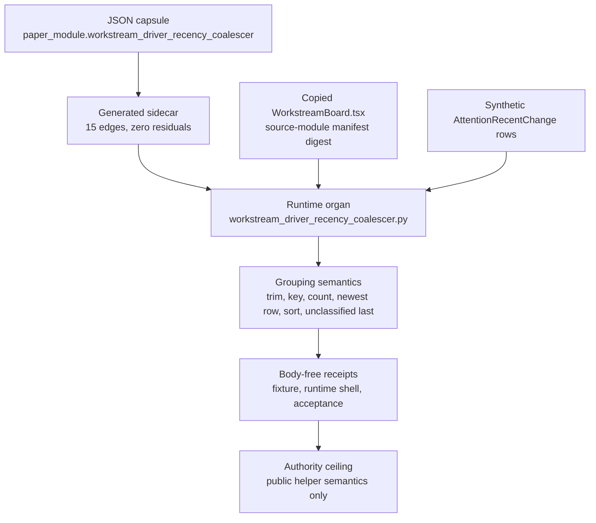

# Workstream Driver Recency Coalescer

## TLDR

`workstream_driver_recency_coalescer` is a Microcosm public semantic-validator organ for the `groupByDriver` helper in `system/server/ui/src/components/cockpit/WorkstreamBoard.tsx`. It imports the real frontend source body as an exact copied non-secret source module and exercises a Python port over synthetic `AttentionRecentChange` rows.

## Macro Source

- Source: `system/server/ui/src/components/cockpit/WorkstreamBoard.tsx`
- Imported target: `examples/workstream_driver_recency_coalescer/exported_workstream_driver_recency_coalescer_bundle/source_modules/system/server/ui/src/components/cockpit/WorkstreamBoard.tsx`
- Source module manifest: `examples/workstream_driver_recency_coalescer/exported_workstream_driver_recency_coalescer_bundle/source_module_manifest.json`
- Digest: `b248325a157e3f7eb7320e430c73b130aa44420f73bfbec334730d5aef595ea7`

## JSON Capsule Binding

- Source row: `core/paper_module_capsules.json::paper_modules[51:paper_module.workstream_driver_recency_coalescer]`
- `source_authority: json_capsule`
- This Markdown is a reader projection. The generated Mermaid projection is
  `available_from_capsule_edges`, and the generated Atlas projection is
  `linked_from_capsule_edges`; both are navigation projections derived from the
  capsule's organ, principle, axiom, dependency, and code-locus edges.
- The proof boundary is the copied non-secret `WorkstreamBoard.tsx` helper,
  synthetic `AttentionRecentChange` rows, Python semantic port, bundle manifest,
  digest checks, and validation receipts.
- The authority ceiling excludes live cockpit state, browser/HUD state,
  provider payloads, operator transcripts, account/session state, source
  mutation, frontend release, dispatch authority, and whole-system correctness.

## Structured Lattice Bindings

The capsule row yields 15 generated relationship edges:

- Two `explains` edges bind the organ to its public helper semantics.
- One `code_locus` edge binds the reader path to
  `system/server/ui/src/components/cockpit/WorkstreamBoard.tsx`.
- Four principle edges and four axiom edges place the validator under the
  Microcosm public-proof and authority-ceiling doctrine it depends on.
- Three `depends_on` paper-module edges and one governed concept edge connect
  this capsule to the reader surfaces that should be opened before broadening
  the claim.

The generated Mermaid projection is `available_from_capsule_edges`, the
generated Atlas projection is `linked_from_capsule_edges`, and
`source_authority` remains `json_capsule`.

## Shape



Evidence/accounting:

- Capsule authority:
  `core/paper_module_capsules.json::paper_modules[51:paper_module.workstream_driver_recency_coalescer]`
  binds the organ, mechanism
  `mechanism.workstream_driver_recency_coalescer.validates_public_workstream_driver_recency_coalescer`,
  and runtime code locus
  `src/microcosm_core/organs/workstream_driver_recency_coalescer.py`.
- Generated instance:
  `paper_modules/workstream_driver_recency_coalescer.json` reports
  `paper_module_payload.source_authority: json_capsule`, Mermaid
  `available_from_capsule_edges`, Atlas `linked_from_capsule_edges`, 15
  relationship edges, and no unpopulated selective relations.
- Source-copy floor:
  `examples/workstream_driver_recency_coalescer/exported_workstream_driver_recency_coalescer_bundle/source_module_manifest.json`
  and copied
  `examples/workstream_driver_recency_coalescer/exported_workstream_driver_recency_coalescer_bundle/source_modules/system/server/ui/src/components/cockpit/WorkstreamBoard.tsx`
  provide the non-secret source helper and digest evidence named by this
  module.
- Runtime and tests:
  `src/microcosm_core/organs/workstream_driver_recency_coalescer.py` exposes
  `run`, `run_workstream_bundle`, `evaluate`, `group_by_driver`,
  `result_card`, `EXPECTED_NEGATIVE_CASES`, and `AUTHORITY_CEILING`.
  `tests/test_workstream_driver_recency_coalescer.py` checks the grouping key,
  recency refresh, timestamp sort, unclassified-last behavior, bundle digest
  validation, negative cases, and body-free receipts.
- Receipts and boundary:
  `receipts/first_wave/workstream_driver_recency_coalescer/workstream_driver_recency_coalescer_result.json`,
  `receipts/acceptance/first_wave/workstream_driver_recency_coalescer_fixture_acceptance.json`,
  and
  `receipts/runtime_shell/demo_project/organs/workstream_driver_recency_coalescer/exported_workstream_driver_recency_coalescer_bundle_validation_result.json`
  support only public helper semantics over synthetic rows and copied
  non-secret source. They do not read live cockpit state, browser/HUD state,
  provider payloads, account/session state, source UI state, or release state.

## Claim Ceiling

This module can claim that a copied non-secret `WorkstreamBoard.tsx` helper,
synthetic `AttentionRecentChange` rows, a Python semantic port, bundle manifest
digests, and focused receipts validate the public grouping and recency-coalescing
semantics named here. It cannot claim live cockpit state, browser/HUD authority,
provider dispatch, account or session access, source UI mutation, frontend
release, or whole-system correctness.

## Validator

The organ validates five public semantics:

- `active_driver` is trimmed for display and lowercased for the grouping key.
- Same-key events increment `count`.
- Newer `recorded_at` collisions refresh `latestIso`, `latestSummary`, and `gateReason`.
- Classified rows sort by latest ISO timestamp descending.
- The fallback `unclassified` bucket is pinned last even when it has the newest timestamp.

## Prior Art Grounding

This helper follows ordinary collection-transformation practice in JavaScript
UI code. `Object.groupBy()` and Lodash `groupBy` provide the established shape
for bucketing records by a computed key, while `Array.prototype.sort()` provides
the ordering primitive used after aggregation. The Microcosm organ keeps that
pattern narrow: normalize the driver key, coalesce same-driver rows, carry the
newest timestamp-derived display fields, and pin the unclassified bucket last
without claiming browser, cockpit, or transcript authority.

Prior-art anchors:

- JavaScript `Object.groupBy()`:
  https://developer.mozilla.org/en-US/docs/Web/JavaScript/Reference/Global_Objects/Object/groupBy
- JavaScript `Array.prototype.sort()`:
  https://developer.mozilla.org/en-US/docs/Web/JavaScript/Reference/Global_Objects/Array/sort
- Lodash `groupBy`:
  https://lodash.com/docs/#groupBy

## Public Boundary

Inputs are synthetic `AttentionRecentChange` literals plus the copied public
frontend source body. The organ does not read live cockpit state, browser/HUD
state, provider payloads, operator transcripts, account/session state, cookies,
or credentials.

## Reader Evidence Routing

Cold-reader audit starts from the generated sidecar
`paper_modules/workstream_driver_recency_coalescer.json`, then follows the
exact-copy source module manifest and fixture inputs.

Evidence should be read in this order:

- Module proof: `paper_module.workstream_driver_recency_coalescer` - the
  generated sidecar confirms that diagram and atlas navigation views are
  available for this module.
- Source-copy proof:
  `examples/workstream_driver_recency_coalescer/exported_workstream_driver_recency_coalescer_bundle/source_module_manifest.json`
  and the copied `WorkstreamBoard.tsx` digest.
- Runtime proof:
  fixture run, exported bundle validation, focused pytest, paper-module corpus
  check, and coverage contract.
- Negative boundary proof:
  absence of live cockpit reads, browser/HUD reads, provider payload reads,
  operator transcript reads, credential reads, source UI mutation, dispatch
  authority, and release authority.

## Receipt Expectations

A complete local receipt should include:

- Fixture execution for the synthetic `AttentionRecentChange` rows.
- Exported bundle validation against the copied source module manifest.
- Focused pytest for
  `tests/test_workstream_driver_recency_coalescer.py`.
- Paper-module corpus check and the shared paper-module coverage contract.
- Projection check when the shared builder lane is clean.
- Generated row proof from
  `paper_modules/workstream_driver_recency_coalescer.json`.

The receipt should preserve the copied `WorkstreamBoard.tsx` digest, synthetic
row semantics, semantic port verdicts, bundle manifest, and all
authority-ceiling exclusions.

## Validation Receipt Path

```bash
PYTHONPATH=src ../repo-python -m microcosm_core.organs.workstream_driver_recency_coalescer run --input fixtures/first_wave/workstream_driver_recency_coalescer/input --out /tmp/microcosm-workstream-driver-recency-coalescer/fixture --acceptance-out /tmp/microcosm-workstream-driver-recency-coalescer/acceptance.json --card
PYTHONPATH=src ../repo-python -m microcosm_core.organs.workstream_driver_recency_coalescer validate-bundle --input examples/workstream_driver_recency_coalescer/exported_workstream_driver_recency_coalescer_bundle --out /tmp/microcosm-workstream-driver-recency-coalescer/bundle --card
PYTHONPATH=src ../repo-python -m pytest -p no:cacheprovider tests/test_workstream_driver_recency_coalescer.py -q
PYTHONPATH=src ../repo-python scripts/build_doctrine_projection.py --check-paper-module-corpus
PYTHONPATH=src ../repo-python scripts/build_doctrine_projection.py --check
```

The fixture and bundle receipts prove only the public grouping/coalescing
semantics over synthetic rows and the copied non-secret frontend helper. They
do not read live cockpit state, browser/HUD state, provider payloads,
account/session state, source UI state, or release readiness.

## Re-Entry Conditions

Re-enter through this paper module when:

- `WorkstreamBoard.tsx` changes in a way that could alter `groupByDriver`
  trimming, lowercasing, collision, timestamp, sort, or unclassified-bucket
  behavior.
- The exported bundle source-module manifest reports a digest mismatch.
- The generated sidecar no longer reports 15 relationship edges, Mermaid
  `available_from_capsule_edges`, Atlas `linked_from_capsule_edges`, or
  `source_authority: json_capsule`.
- A receipt tries to promote this helper proof into live cockpit authority,
  provider dispatch authority, account/session authority, or frontend release
  authority.

## Authority Ceiling

This organ proves a small public UI grouping helper has a runnable Microcosm
capsule. It does not prove workstream classification correctness, authorize
frontend release, mutate the source UI, dispatch providers, or claim
whole-system correctness.
