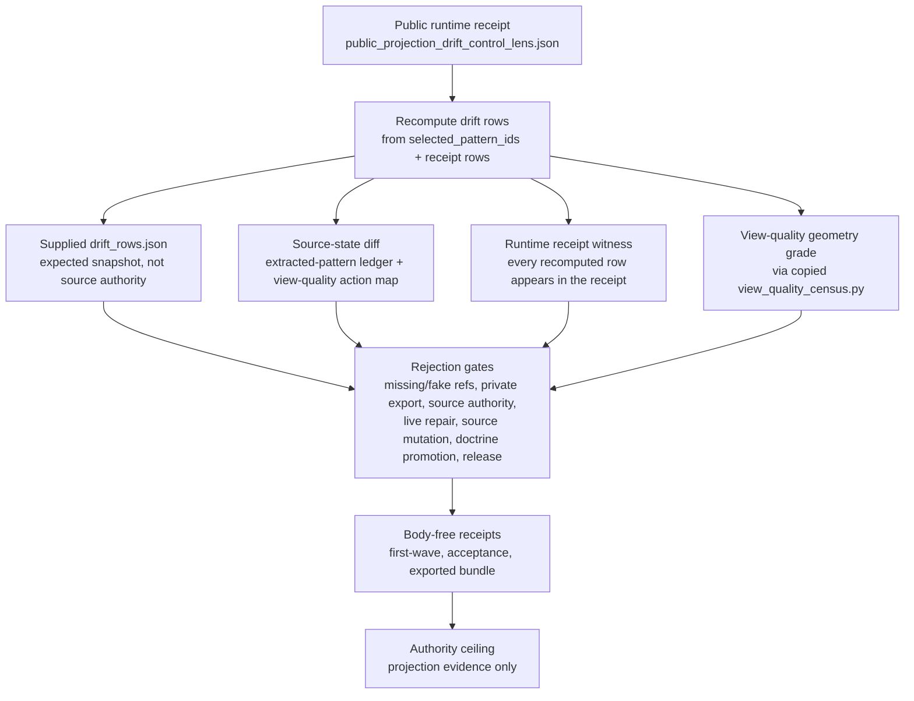

# World-Model Projection Drift Control Room

## Abstract

`world_model_projection_drift_control_room` is Microcosm's public
projection-drift control organ. It turns projected world-model rows into an
auditable runtime receipt: each row must carry a source signal, source ref,
target ref, repair route, validation ref, fact-authority mesh, and explicit
anti-claim booleans before the projection can pass.

The mechanism is deliberately narrow. It validates that public, body-free
projection rows remain tied to named source evidence and rejection policy; it
does not claim that the projection is source authority, that a live route was
repaired, that private runtime state was inspected, or that Microcosm is
publication-authorized or release-authorized.

## Purpose

This organ exists to answer one question: when a public read model says
something has drifted, can that claim still be traced back to a real source
artifact, or has the read model quietly started to stand in for the source?

The design choice that makes this more than a shape check is that the supplied
`drift_rows.json` is never trusted as input. The validator recomputes the drift
rows from the public runtime receipt, then treats the supplied file only as an
expected snapshot whose role is recorded as `expected_snapshot_not_source_authority`.
If the snapshot disagrees with the recomputed rows, that is flagged as staleness,
not accepted as fact. Each recomputed row is then diffed against a real
source-state artifact: a row from the extracted-pattern ledger, or a view-quality
action-map lens whose own summary is re-derived from its action rows. A row that
cannot be re-derived from source, or whose guard reference or derivation path has
changed, moves the verdict to `blocked`.

The same boundary holds in the other direction. A drift row may name a repair
route, but the route stays a label rather than an action: the validator rejects
any row that authorises live repair, source mutation, automatic doctrine
promotion, or release. A projection here can describe what is wrong and where to
go next without ever being allowed to act on it or to speak for the source it
describes.

## Telos

Projection drift is the failure mode where a useful read model begins to look
like truth. A dashboard row, generated sidecar, route card, or public runtime
receipt can be correct enough for navigation while still being downstream of a
source artifact that owns the actual authority.

This organ makes that boundary executable. It accepts public drift rows only
when they retain:

- a real source signal and source ref
- a target ref that names where the projection appears
- a repair-route label that remains a route, not a live mutation
- a validation ref that can witness the row
- a fact-authority record with authority, appearance, derivation, guard, and
  residual-route fields
- body-free receipt policy and an explicit authority ceiling

## Technical Object

The runtime locus is
`src/microcosm_core/organs/world_model_projection_drift_control_room.py`.
The exported public example is
`examples/world_model_projection_drift_control_room/exported_projection_drift_control_bundle`.
The accepted first-wave fixture is
`fixtures/first_wave/world_model_projection_drift_control_room/input`.

The organ exposes two public validation routes:

```bash
cd microcosm-substrate
PYTHONPATH=src ../repo-python -m microcosm_core.organs.world_model_projection_drift_control_room \
  run \
  --input fixtures/first_wave/world_model_projection_drift_control_room/input \
  --out /tmp/microcosm_world_model_projection_drift_first_wave \
  --acceptance-out /tmp/microcosm_world_model_projection_drift_acceptance.json
```

```bash
cd microcosm-substrate
PYTHONPATH=src ../repo-python -m microcosm_core.organs.world_model_projection_drift_control_room \
  run-drift-control-bundle \
  --input examples/world_model_projection_drift_control_room/exported_projection_drift_control_bundle \
  --out /tmp/microcosm_world_model_projection_drift_bundle
```

## Projection-Drift Mechanism

The validator recomputes the public projection rows from runtime receipts and
source artifacts, then compares them with the supplied fixture snapshot. A row
passes only when the recomputed projection, supplied snapshot, source-ref
evidence, source-state diff, source-module manifest check, copied-body geometry
probe, runtime receipt witness, and private-state exclusion scan all stay
inside the public boundary.

The core result payload records:

- `drift_summary.row_count: 8`
- `source_ref_count: 8`
- `target_ref_count: 8`
- `repair_route_count: 8`
- `validation_ref_count: 8`
- `fact_authority_row_count: 8`
- `guarded_projection_treatment_count: 8`
- `unguarded_duplicate_count: 0`
- `runtime_receipt_witnessed_row_count: 8`
- `source_authority_claim_count: 0`
- `live_repair_authorized_count: 0`
- `source_mutation_authorized_count: 0`
- `automatic_doctrine_promotion_count: 0`

The source-state receipt evidence is intentionally small and inspectable. The
focused test suite expects exactly two source-state evidence classes:
`extracted_pattern_ledger_row_diff` and
`view_quality_action_map_summary_diff`.

## Runtime Receipt Evidence

The public receipt floor is body-free. The first-wave receipts live at:

- `receipts/first_wave/world_model_projection_drift_control_room/world_model_projection_drift_control_room_result.json`
- `receipts/first_wave/world_model_projection_drift_control_room/world_model_projection_drift_control_room_validation_receipt.json`
- `receipts/acceptance/first_wave/world_model_projection_drift_control_room_fixture_acceptance.json`

The exported-bundle receipt lives at:

- `receipts/runtime_shell/demo_project/organs/world_model_projection_drift_control_room/exported_projection_drift_control_bundle_validation_result.json`

The exported-bundle receipt records
`body_import_status: real_runtime_receipt_landed`,
`body_material_status: copied_non_secret_macro_body_landed`,
`body_copied_material_count: 4`, `body_in_receipt: false`, and
`release_authorized: false`. Its authority ceiling also sets
`source_authority_claim`, `source_mutation_authorized`,
`live_route_repair_authorized`, `automatic_doctrine_promotion_authorized`,
`provider_payload_exported`, `publication_authorized`, and
`release_authorized` to false.

## Source-Available Body Floor

The exported bundle includes copied non-secret macro bodies so a reader can
inspect the implementation class without receiving private runtime state in the
receipt. The source-module manifest is:

- `examples/world_model_projection_drift_control_room/exported_projection_drift_control_bundle/source_module_manifest.json`

It records four copied modules:

- `world_model_drift_aggregate_source_body_import`
- `world_model_drift_endpoint_source_body_import`
- `view_quality_action_map_source_body_import`
- `view_quality_action_map_test_body_import`

Every manifest row is `body_copied: true`, `body_in_receipt: false`,
`classification: copied_non_secret_macro_body`, and
`material_class: public_macro_tool_body`, with `sha256_match: true`. The
largest bodies are the Station world-model reducer
`system/server/world_model.py`, the `/api/drift` endpoint in
`system/server/main.py`, the view-quality action-map builder
`tools/meta/observability/view_quality_census.py`, and its focused macro
regression test `system/server/tests/test_view_quality_census.py`.

The body floor is therefore source-available by bundle, not by receipt.
Receipts carry paths, hashes, counts, anchor checks, and verdicts; they do not
duplicate private bodies, provider payloads, browser/HUD state, account/session
material, raw operator voice, recipient-send state, or credential-equivalent
payloads.

## Mutation and Rejection Contract

The validator is not a shape-only check. The focused test suite mutates the
public inputs and requires the verdict to move to `blocked` when authority or
freshness is broken:

- missing source refs produce `DRIFT_SOURCE_REF_REQUIRED`
- missing repair or validation refs produce `DRIFT_VALIDATION_REF_REQUIRED`
- missing fact-authority mesh produces `DRIFT_FACT_AUTHORITY_REQUIRED`
- projection rows claiming source authority produce
  `DRIFT_SOURCE_AUTHORITY_FORBIDDEN`
- live repair authority produces `DRIFT_LIVE_REPAIR_FORBIDDEN`
- private runtime export produces `DRIFT_PRIVATE_RUNTIME_EXPORT_FORBIDDEN`
- provider payload export produces `DRIFT_PROVIDER_PAYLOAD_FORBIDDEN`
- automatic doctrine promotion produces
  `DRIFT_AUTOMATIC_DOCTRINE_PROMOTION_FORBIDDEN`
- release authority produces `DRIFT_RELEASE_AUTHORITY_FORBIDDEN`

Additional source-drift tests cover unwitnessed runtime rows, stale supplied
snapshots, mutated runtime receipt refs, missing source-ledger rows, source
ledger rows without `source_refs`, view-quality source mutation, internally
consistent fake source refs, and selected-row order drift. These cases matter
because a projection can be internally coherent and still lose authority if its
source evidence, guard receipt, or derivation path changes.

## Governing Lattice Bindings

- Capsule row:
  `core/paper_module_capsules.json::paper_modules[27:paper_module.world_model_projection_drift_control_room]`
- Generated instance:
  `paper_modules/world_model_projection_drift_control_room.json`
- Standard:
  `standards/std_microcosm_world_model_projection_drift_control_room.json`
- Mechanism:
  `mechanism.world_model_projection_drift_control_room.validates_public_projection_drift_control_boundary`
- Concept:
  `concept.import_projection_and_drift_control_bundle`
- Principle refs:
  `P-1`, `P-2`, `P-3`, `P-5`, `P-6`, `P-8`, `P-9`, `P-12`, `P-15`
- Axiom refs:
  `AX-1`, `AX-4`, `AX-5`, `AX-7`, `AX-8`, `AX-11`

The generated JSON instance reports `source_authority: json_capsule`, 19
resolved relationship edges, Mermaid `available_from_capsule_edges`, Atlas
`linked_from_capsule_edges_after_atlas_binding`, and one honest selective
residual for `paper_module.depends_on.paper_module` because the capsule does
not yet name a sibling dependency module.

## Shape



The diagram is a reader projection. It sketches the evidence path and authority
ceiling; it is not the generated Mermaid projection and does not replace the
capsule-backed generated lattice.

## JSON Capsule Binding

- Capsule row:
  `paper_module.world_model_projection_drift_control_room` in
  `core/paper_module_capsules.json::paper_modules[27:paper_module.world_model_projection_drift_control_room]`.
- source_authority: json_capsule
- This Markdown is a reader projection; the JSON capsule is source authority for
  subjects, code loci, doctrine refs, and generated projection state.
- The generated Mermaid projection is `available_from_capsule_edges`; the
  generated Atlas projection is
  `linked_from_capsule_edges_after_atlas_binding`.
- The proof boundary is the body-free runtime receipt, copied source-module
  manifest, drift fixture rows, source-state mutation tests, copied-body
  geometry tests, and validation receipts named here, not source authority,
  source mutation, live route repair, release, publication, or whole-system
  correctness.
- authority ceiling: public body-free runtime receipt and copied non-secret
  source-module evidence only; no private runtime body inspection, source
  authority, source mutation, live route repair, automatic doctrine promotion,
  provider payload export, release approval, publication approval, or
  whole-system correctness claim.

## JSON Capsule Boundary

The capsule row is the source of the paper-module relationships. This Markdown
page, the generated JSON instance, Mermaid projection, Atlas projection, and
public-site cards are reader projections over that row and its accepted source
evidence. Treat generated readback as navigation evidence, not as permission to
hand-edit capsule rows, aggregate lattice projections, public-site HTML,
object maps, search indexes, or receipt payloads.

Future expansion re-enters through the capsule owner lane when the drift organ,
mechanism subject, source-module manifest, geometry probe, or receipt contract
changes. The safe sequence is: update the real capsule or source owner row,
refresh the generated paper-module corpus with its builder, rerun the focused
world-model drift tests, and keep the paper-module coverage contract green or
bind any unrelated red to its owning residual. A Markdown edit alone does not
expand subject authority, source authority, release authority, publication
authority, live route repair authority, or whole-system correctness.

## Validation

Focused runtime validation:

```bash
PYTHONPATH=microcosm-substrate/src ./repo-pytest \
  microcosm-substrate/tests/test_world_model_projection_drift_control_room.py -q
```

Paper-module corpus validation:

```bash
cd microcosm-substrate
PYTHONPATH=src ../repo-python scripts/build_doctrine_projection.py --check-paper-module-corpus
```

Paper-module index validation from the repo root:

```bash
./repo-python tools/meta/factory/build_paper_module_index.py --check
```

## Limitations

The organ validates metadata-only drift receipts and public-source refs. It
supports inspection of recorded drift rows; live repair, source control,
doctrine promotion, model-output export, public sharing, and launch are outside
the fixture. It also does not claim that every possible world-model drift source
is covered. Its claim is narrower: the named public drift rows are guarded by
source refs, target refs, validation refs, fact-authority mesh, copied source
body evidence, metadata-only receipts, and negative-case rejection.

## Reader Evidence Routing

Read in this order:

1. Capsule and generated instance:
   `core/paper_module_capsules.json::paper_modules[27:paper_module.world_model_projection_drift_control_room]`
   and `paper_modules/world_model_projection_drift_control_room.json`.
2. Runtime source and focused tests:
   `src/microcosm_core/organs/world_model_projection_drift_control_room.py`
   and `tests/test_world_model_projection_drift_control_room.py`.
3. First-wave fixture and receipts:
   `fixtures/first_wave/world_model_projection_drift_control_room/input`,
   `receipts/first_wave/world_model_projection_drift_control_room/`, and
   `receipts/acceptance/first_wave/world_model_projection_drift_control_room_fixture_acceptance.json`.
4. Exported-bundle evidence:
   `examples/world_model_projection_drift_control_room/exported_projection_drift_control_bundle/`
   and
   `receipts/runtime_shell/demo_project/organs/world_model_projection_drift_control_room/exported_projection_drift_control_bundle_validation_result.json`.
5. Generated projection evidence:
   Mermaid `available_from_capsule_edges`, Atlas
   `linked_from_capsule_edges_after_atlas_binding`, and the one selective
   dependency residual preserved by the generated JSON instance.

## Re-Entry Conditions

Re-enter through this paper module when:

- the drift-control organ changes source signal, source ref, repair-route,
  validation-ref, target-ref, negative-case, source-state diff, or receipt-row
  semantics
- the exported bundle or source-module manifest no longer validates copied
  non-secret macro bodies without placing bodies into receipts
- the copied-body geometry probe changes its synthetic rendered-geometry verdict
  classes
- the generated sidecar no longer reports 19 relationship edges, one honest
  selective residual, Mermaid `available_from_capsule_edges`, Atlas
  `linked_from_capsule_edges_after_atlas_binding`, or
  `source_authority: json_capsule`
- a claim tries to promote projection-drift evidence into registry authority,
  source authority, live route repair authority, source mutation authority,
  publication approval, release approval, or whole-system correctness
